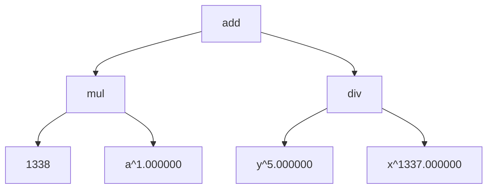
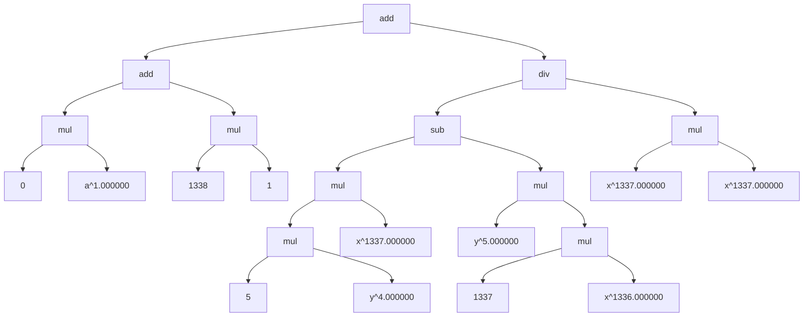
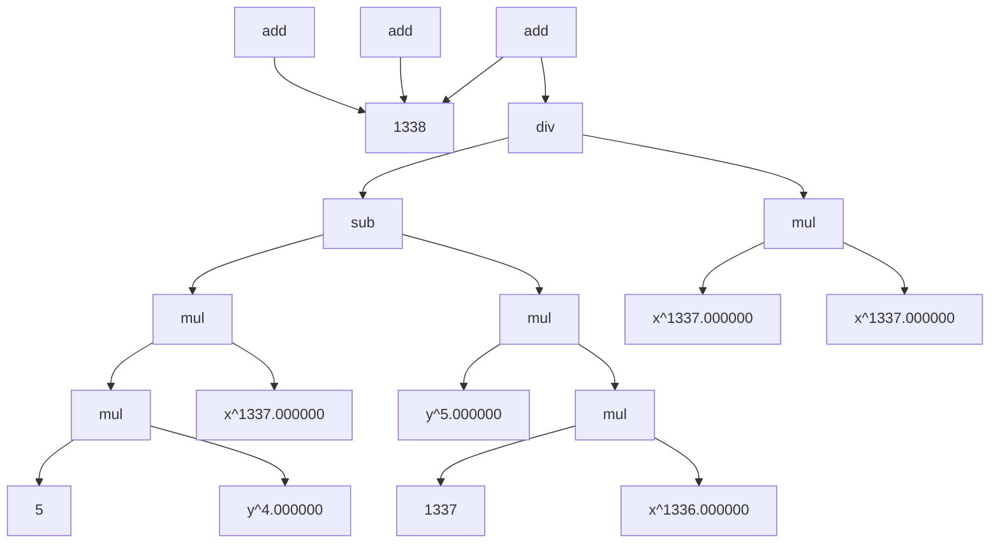

## Background

Let's write an auto differentiation algorithm. We will take mathematical expressions
in prefix notation, build an expression tree like the one below for \\(1338 * a + \frac{y^5}{x^{1335}}\\)

```c
// expression in prefix notation
Expr e = ADD_EXPR(
    MUL_EXPR(INT_CONSTANT_EXPR(1338), VAR_EXPR("a", 1)),
    DIV_EXPR(VAR_EXPR("y", 5), VAR_EXPR("x", 1337))
);
```



and then write an algorithm to traverse the expression tree, taking derivatives of each sub-expression
recursively and then generating a new expression tree that represents the derivative of the original
expression tree, like the one below by just doing `ExprGrad(&e)`



which in a more mathematician-readable form is 

\\[ \left( (0 \cdot a) + (1338 \cdot 1) \right) + \frac{ \left( (5 \cdot y^{4}) \cdot x^{1337} \right) - \left( y^{5} \cdot (1337 \cdot x^{1336}) \right) }{\left( x^{1337} \cdot x^{1337} \right) }
\\]

and we can also algorithmically simplify the above big expression tree, to a small one (if possible)
by again traversing the tree recursively, simplifying sub-expressions and performing simplifications
by applying well known simplification rules.



which is 
\\[1338 + \frac{\left(5 \cdot y^4 \cdot x^{1337}\right) - \left(y^5 \cdot \left(1337 \cdot x^{1336}\right)\right)}{x^{1337}}\\]

The simplification algorithm obiously is not working correctly for the root node for some reason, but
in excitement to write this blog post and move ahead by trying some other cool things, I'll just
continue without debugging it. I took help of ChatGPT to write a function to emit code for GraphViz (xdot)
files. Using that I generated the diagrams that you see above. Using LLMs is a good way to generate
code fast, if you know already how it works. It obviously generated the code wrong, and I had to debug it.
Had I know already had experience on how to emit GraphViz when provided a tree like the one above, it would've
took a significant amount of time to debug that simple problem.  

> I also often find that my willingness to debug a bug, helps triage it faster. Resolving the bug is just another issue.

## The Expression Tree

Computers are able to better deal with expressions in prefix notation (at least in my experience). This is not
just for just mathematical expressions, those into compilers might already have a good idea about this (I'm talking about the AST).
The future goal would be to take an expression in infix notation and parse it to the expression tree in prefix notation.

So, what does this expression tree look like and how to build it? For now, my expression tree does not cover a lot of mathematics,
and must only be covered as a PoC. You don't really expect me to create a complete library and then write a code about it! Do you?

### Atoms

Atoms are the building blocks of expression trees. An atom is just like the usual definition goes, is an indivisible component
of an expression in our AutoGrad engine. Can you guess what these might be? For me its

- constants, like real numbers and integers,
- and variables raised to constant power.

This totally depends on how you want to design your expression tree. The main idea behind atoms is that you know how to compute
their derivate directly.

- For constants the derivate is always 0.
- We also know derivatives for variables raised to constant power.

And for each of these, I won't have to call the `ExprGrad` method recursively.

```c
typedef enum {
    CONSTANT_TYPE_INVALID = 0,
    CONSTANT_TYPE_INTEGER,
    CONSTANT_TYPE_REAL,
    CONSTANT_TYPE_MAX
} ConstantType;

typedef struct {
    ConstantType type;
    union {
        int64_t integer;
        double  real;
    };
} Constant;

typedef struct {
    const char* name;
    double      exponent;
} Variable;
```

## Operators

If you consider atoms as word of our language of mathematical expressions, then operators are connectives (like and, or, not,  etc...).
There are two types of connectives in my language : 

- Unary : `+ expr`, `- expr`, I can also include others like `! expr`, `~ expr`, `d/dx expr`, `integrate expr`, etc... but they don't make sense at this point of our journey.
- Binary : (add) `expr + expr`, (sub) `expr - expr`, (mul) `expr * expr`, (div) `expr / expr`

In mathematics there are many many unary operators, as you expand your domain of expressions. You can treat each differential equation
as a mathematical operator. Algebraic expressions of matrices can be considered as operators, and even the matrices are operators, given the
domain is selected carefully.

In my language, I have implemented these in the following way : 

```c
typedef enum {
    UNARY_EXPR_TYPE_INVALID = 0,
    UNARY_EXPR_TYPE_NEGATE,   /// - expr
    UNARY_EXPR_TYPE_IDENTITY, /// + expr
    UNARY_EXPR_TYPE_MAX
} UnaryExprType;

typedef struct {
    UnaryExprType type;
    struct Expr*  expr;
} UnaryExpr;

typedef enum {
    BINARY_EXPR_TYPE_INVALID = 0,
    BINARY_EXPR_TYPE_ADD,
    BINARY_EXPR_TYPE_SUB,
    BINARY_EXPR_TYPE_MUL,
    BINARY_EXPR_TYPE_DIV,
    BINARY_EXPR_TYPE_MAX
} BinaryExprType;

typedef struct {
    BinaryExprType type;

    struct Expr* left;
    struct Expr* right;
} BinaryExpr;
```

## Expression

Using the analogy of languages again, 

- if atoms are words,
- operators are connectives,

then can you guess what an expression is? They're the sentences of the language. They're complete, well formed sentences of
the language of mathematical expressions.

```c
typedef enum {
    EXPR_TYPE_INVALID = 0,
    EXPR_TYPE_CONSTANT,
    EXPR_TYPE_VARIABLE,
    EXPR_TYPE_UNARY,
    EXPR_TYPE_BINARY,
    EXPR_TYPE_NAN,
    EXPR_TYPE_MAX
} ExprType;

typedef struct Expr {
    ExprType type;

    union {
        Constant   constant;
        Variable   variable;
        UnaryExpr  unary;
        BinaryExpr binary;
    };
} Expr;
```

I've defined functions to interact with expressions only, and no other struct or enum.

```c
Expr*   ExprCreateClone(Expr* expr);
Expr*   ExprCreate();
void    ExprDestroy(Expr* expr);
Expr*   ExprToString(Expr* expr, String* str);
Expr*   ExprSimplify(Expr* expr);
Expr*   ExprGrad(Expr* expr);
String* ExprEmitXdot(Expr* expr, String* output);
int     SubExprEmitXdot(String* output, Expr* subexpr, int* node_id);
```

## Macro Magic

I love C macros, because if you use them smartly, they make the code more readable, and faster to write
at the same time. You can do more my writing less. At the same time, it's very easy to

> shoot yourself in the foot

by overdoing it. Many experienced devs advice against using macros. I don't see a reason not to use them,
if you know what you're doing.

```c
#define INT_CONSTANT_EXPR(i)                                                                       \
    ((Expr) {                                                                                      \
        .type     = EXPR_TYPE_CONSTANT,                                                            \
        .constant = {.type = CONSTANT_TYPE_INTEGER, .integer = (i)}                                \
    })

#define REAL_CONSTANT_EXPR(r)                                                                      \
    ((Expr) {                                                                                      \
        .type     = EXPR_TYPE_CONSTANT,                                                            \
        .constant = {.type = CONSTANT_TYPE_REAL, .real = (r)}                                      \
    })

#define VAR_EXPR(n, pow)                                                                           \
    ((Expr) {                                                                                      \
        .type     = EXPR_TYPE_VARIABLE,                                                            \
        .variable = {.name = (n), .exponent = (pow)}                                               \
    })

#define NEGATE_EXPR(e)                                                                             \
    ((Expr) {                                                                                      \
        .type  = EXPR_TYPE_UNARY,                                                                  \
        .unary = {.type = UNARY_EXPR_TYPE_NEGATE, .expr = &(e)}                                    \
    })

#define IDENTITY_EXPR(e)                                                                           \
    ((Expr) {                                                                                      \
        .type  = EXPR_TYPE_UNARY,                                                                  \
        .unary = {.type = UNARY_EXPR_TYPE_IDENTITY, .expr = &(e)}                                  \
    })


#define ADD_EXPR(le, re)                                                                           \
    ((Expr) {                                                                                      \
        .type   = EXPR_TYPE_BINARY,                                                                \
        .binary = {.type = BINARY_EXPR_TYPE_ADD, .left = &(le), .right = &(re)}                    \
    })


#define SUB_EXPR(le, re)                                                                           \
    ((Expr) {                                                                                      \
        .type   = EXPR_TYPE_BINARY,                                                                \
        .binary = {.type = BINARY_EXPR_TYPE_SUB, .left = &(le), .right = &(re)}                    \
    })

#define MUL_EXPR(le, re)                                                                           \
    ((Expr) {                                                                                      \
        .type   = EXPR_TYPE_BINARY,                                                                \
        .binary = {.type = BINARY_EXPR_TYPE_MUL, .left = &(le), .right = &(re)}                    \
    })

#define DIV_EXPR(le, re)                                                                           \
    ((Expr) {                                                                                      \
        .type   = EXPR_TYPE_BINARY,                                                                \
        .binary = {.type = BINARY_EXPR_TYPE_DIV, .left = &(le), .right = &(re)}                    \
    })
```

## Algorithmic Differentiation

The differentiation part is very easy. You just have to follow the differentiation rules for atoms,
and for operators you take each sub-expression and apply differentiation on those recursively. Take
some time to realize that this is just like traversing a tree in depth first seach, except that we're
not searching anything here, and just traversing the tree completely to get the final expression.

When reading the code provided below, keep this fact in mind, and you'll get that in first glance.
Also, when reading a particular section, keep in mind how that type of expression should be differentiated
in general mathematics.

```c
Expr* ExprGrad(Expr* expr) {
    if(!expr) {
        LOG_ERROR("invalid arguments.");
        return NULL;
    }

    switch(expr->type) {
        case EXPR_TYPE_CONSTANT : {
            Expr* grad             = ExprCreate();
            grad->type             = EXPR_TYPE_CONSTANT;
            grad->constant.type    = CONSTANT_TYPE_INTEGER;
            grad->constant.integer = 0;
            return grad;
        }

        case EXPR_TYPE_VARIABLE : {
            Expr* grad = ExprCreate();
            switch((int64_t)expr->variable.exponent) {
                case 0 : {
                    grad->type             = EXPR_TYPE_CONSTANT;
                    grad->constant.type    = CONSTANT_TYPE_INTEGER;
                    grad->constant.integer = 0;
                    return grad;
                }
                case 1 : {
                    grad->type             = EXPR_TYPE_CONSTANT;
                    grad->constant.type    = CONSTANT_TYPE_INTEGER;
                    grad->constant.integer = 1;
                    return grad;
                }
                default : {
                    grad->type        = EXPR_TYPE_BINARY;
                    grad->binary.type = BINARY_EXPR_TYPE_MUL;
                    Expr  lexpr       = INT_CONSTANT_EXPR(expr->variable.exponent);
                    Expr  rexpr       = VAR_EXPR(expr->variable.name, expr->variable.exponent - 1);
                    Expr* lec         = ExprCreateClone(&lexpr);
                    if(!lec) {
                        LOG_ERROR("failed to create sub-expr clone");
                        ExprDestroy(grad);
                        return NULL;
                    }
                    Expr* rec = ExprCreateClone(&rexpr);
                    if(!rec) {
                        LOG_ERROR("failed to create sub-expr clone");
                        ExprDestroy(grad);
                        ExprDestroy(lec);
                        return NULL;
                    }
                    grad->binary.left  = lec;
                    grad->binary.right = rec;
                    return grad;
                }
            }
        }

        case EXPR_TYPE_UNARY : {
            switch(expr->unary.type) {
                case UNARY_EXPR_TYPE_IDENTITY :
                case UNARY_EXPR_TYPE_NEGATE : {
                    Expr* grad       = ExprCreate();
                    grad->type       = EXPR_TYPE_UNARY;
                    grad->unary.type = expr->unary.type;
                    grad->unary.expr = ExprGrad(expr->unary.expr);
                    return grad;
                }
                default : {
                    LOG_ERROR("invalid unary sub-expression type.");
                    return NULL;
                }
            }
        }

        case EXPR_TYPE_BINARY : {
            switch(expr->binary.type) {
                case BINARY_EXPR_TYPE_ADD :
                case BINARY_EXPR_TYPE_SUB : {
                    Expr* grad         = ExprCreate();
                    grad->type         = EXPR_TYPE_BINARY;
                    grad->binary.type  = expr->binary.type;
                    grad->binary.left  = ExprGrad(expr->binary.left);
                    grad->binary.right = ExprGrad(expr->binary.right);
                    if(!expr->binary.left || !expr->binary.right) {
                        LOG_ERROR("failed to auto-grad binary sub-expr");
                        ExprDestroy(grad);
                        return NULL;
                    }
                    return grad;
                }
                case BINARY_EXPR_TYPE_MUL : {
                    Expr* grad         = ExprCreate();
                    grad->type         = EXPR_TYPE_BINARY;
                    grad->binary.type  = BINARY_EXPR_TYPE_ADD;
                    grad->binary.left  = ExprCreate();
                    grad->binary.right = ExprCreate();
                    if(!grad->binary.left || !grad->binary.right) {
                        LOG_ERROR("failed to create auto-grad sub-expr");
                        ExprDestroy(grad);
                        return NULL;
                    }

                    // grad(expr) = grad(left)*right + left*grad(right)
                    Expr* dl_r = grad->binary.left;
                    Expr* l_dr = grad->binary.right;

                    dl_r->type         = EXPR_TYPE_BINARY;
                    dl_r->binary.type  = BINARY_EXPR_TYPE_MUL;
                    dl_r->binary.left  = ExprGrad(expr->binary.left);
                    dl_r->binary.right = ExprCreateClone(expr->binary.right);
                    if(!dl_r->binary.left || !dl_r->binary.right) {
                        LOG_ERROR("failed to create auto-grad sub-expr");
                        ExprDestroy(grad);
                        return NULL;
                    }

                    l_dr->type         = EXPR_TYPE_BINARY;
                    l_dr->binary.type  = BINARY_EXPR_TYPE_MUL;
                    l_dr->binary.left  = ExprCreateClone(expr->binary.left);
                    l_dr->binary.right = ExprGrad(expr->binary.right);
                    if(!l_dr->binary.left || !l_dr->binary.right) {
                        LOG_ERROR("failed to create auto-grad sub-expr");
                        ExprDestroy(grad);
                        return NULL;
                    }

                    return grad;
                }
                case BINARY_EXPR_TYPE_DIV : {
                    Expr* grad         = ExprCreate();
                    grad->type         = EXPR_TYPE_BINARY;
                    grad->binary.type  = BINARY_EXPR_TYPE_DIV;
                    grad->binary.left  = ExprCreate();
                    grad->binary.right = ExprCreate();
                    if(!grad->binary.left || !grad->binary.right) {
                        LOG_ERROR("failed to create auto-grad sub-expr");
                        ExprDestroy(grad);
                        return NULL;
                    }

                    // grad(expr) = (grad(left)*right - left*grad(right))/(grad(right) * grad(right))
                    Expr* nr = grad->binary.left;
                    Expr* dr = grad->binary.right;

                    // create denominator
                    dr->type         = EXPR_TYPE_BINARY;
                    dr->binary.type  = BINARY_EXPR_TYPE_MUL;
                    dr->binary.left  = ExprCreateClone(expr->binary.right);
                    dr->binary.right = ExprCreateClone(expr->binary.right);
                    if(!dr->binary.left || !dr->binary.right) {
                        LOG_ERROR("failed to create auto-grad sub-expr");
                        ExprDestroy(grad);
                        return NULL;
                    }

                    // create numerator
                    nr->type         = EXPR_TYPE_BINARY;
                    nr->binary.type  = BINARY_EXPR_TYPE_SUB;
                    nr->binary.left  = ExprCreate();
                    nr->binary.right = ExprCreate();
                    if(!nr->binary.left || !nr->binary.right) {
                        LOG_ERROR("failed to create auto-grad sub-expr");
                        ExprDestroy(grad);
                        return NULL;
                    }

                    Expr* dl_r = nr->binary.left;
                    Expr* l_dr = nr->binary.right;

                    dl_r->type         = EXPR_TYPE_BINARY;
                    dl_r->binary.type  = BINARY_EXPR_TYPE_MUL;
                    dl_r->binary.left  = ExprGrad(expr->binary.left);
                    dl_r->binary.right = ExprCreateClone(expr->binary.right);
                    if(!dl_r->binary.left || !dl_r->binary.right) {
                        LOG_ERROR("failed to create auto-grad sub-expr");
                        ExprDestroy(grad);
                        return NULL;
                    }

                    l_dr->type         = EXPR_TYPE_BINARY;
                    l_dr->binary.type  = BINARY_EXPR_TYPE_MUL;
                    l_dr->binary.left  = ExprCreateClone(expr->binary.left);
                    l_dr->binary.right = ExprGrad(expr->binary.right);
                    if(!l_dr->binary.left || !l_dr->binary.right) {
                        LOG_ERROR("failed to create auto-grad sub-expr");
                        ExprDestroy(grad);
                        return NULL;
                    }
                    return grad;
                }
                default : {
                    LOG_ERROR("invalid binary sub-expression type.");
                    return NULL;
                }
            }
        }

        default : {
            LOG_ERROR("invalid expression type.");
            return NULL;
        }
    }
}
```

## Simplification Rules

Simplification again is just depth-first-traversal like taking derivative, with some
simplification rules. The more rules you add, the more simplified form you get in the end.

```c
Expr* ExprSimplify(Expr* expr) {
    if(!expr) {
        LOG_ERROR("invalid arguments");
        return NULL;
    }

    switch(expr->type) {
        case EXPR_TYPE_NAN :
        case EXPR_TYPE_CONSTANT : {
            return expr;
        }

        case EXPR_TYPE_VARIABLE : {
            if(expr->variable.exponent == 0) {
                free((void*)expr->variable.name);
                expr->type             = EXPR_TYPE_CONSTANT;
                expr->constant.type    = CONSTANT_TYPE_INTEGER;
                expr->constant.integer = 1;
            }
            return expr;
        }

        case EXPR_TYPE_UNARY : {
            if(expr->unary.expr->type == EXPR_TYPE_NAN) {
                ExprDestroy(expr->unary.expr);
                memset(expr, 0, sizeof(Expr));
                expr->type = EXPR_TYPE_NAN;
                return expr;
            }

            expr->unary.expr = ExprSimplify(expr->unary.expr);

            Expr tmp = *expr->unary.expr;
            free((void*)expr->unary.expr);
            *expr = tmp;

            return expr;
        }

        case EXPR_TYPE_BINARY : {
            expr->binary.left  = ExprSimplify(expr->binary.left);
            expr->binary.right = ExprSimplify(expr->binary.right);

            // any op with NaN is NaN
            if(expr->binary.right->type == EXPR_TYPE_NAN ||
               expr->binary.left->type == EXPR_TYPE_NAN) {
                ExprDestroy(expr->binary.left);
                ExprDestroy(expr->binary.right);
                memset(expr, 0, sizeof(Expr));
                expr->type = EXPR_TYPE_NAN;
                return expr;
            }

            switch(expr->binary.type) {
                case BINARY_EXPR_TYPE_ADD :
                case BINARY_EXPR_TYPE_SUB : {
                    // add or sub with 0 is identity
                    bool delete_left = false, delete_right;
                    if(expr->binary.left->type == EXPR_TYPE_CONSTANT &&
                       expr->binary.left->constant.integer == 0) {
                        delete_left = true;
                        ExprDestroy(expr->binary.left);
                    }
                    if(expr->binary.right->type == EXPR_TYPE_CONSTANT &&
                       expr->binary.right->constant.integer == 0) {
                        delete_right = true;
                        ExprDestroy(expr->binary.right);
                    }

                    if(delete_left && !delete_right) {
                        expr->type       = EXPR_TYPE_UNARY;
                        expr->unary.type = UNARY_EXPR_TYPE_IDENTITY;
                        expr->unary.expr = expr->binary.right;
                    } else if(!delete_left && delete_right) {
                        expr->type       = EXPR_TYPE_UNARY;
                        expr->unary.type = UNARY_EXPR_TYPE_IDENTITY;
                        expr->unary.expr = expr->binary.left;
                    } else if(delete_left && delete_right) {
                        expr->type             = EXPR_TYPE_CONSTANT;
                        expr->constant.type    = CONSTANT_TYPE_INTEGER;
                        expr->constant.integer = 0;
                    }

                    return expr;
                }

                case BINARY_EXPR_TYPE_MUL : {
                    // multiplicatin with 0 is 0
                    if((expr->binary.left->type == EXPR_TYPE_CONSTANT &&
                        expr->binary.left->constant.integer == 0) ||
                       (expr->binary.right->type == EXPR_TYPE_CONSTANT &&
                        expr->binary.right->constant.integer == 0)) {
                        ExprDestroy(expr->binary.left);
                        ExprDestroy(expr->binary.right);
                        expr->type             = EXPR_TYPE_CONSTANT;
                        expr->constant.type    = CONSTANT_TYPE_INTEGER;
                        expr->constant.integer = 0;
                        return expr;
                    }

                    // product with multiplicative identity
                    bool delete_left = false, delete_right;
                    if(expr->binary.left->type == EXPR_TYPE_CONSTANT &&
                       expr->binary.left->constant.integer == 1) {
                        delete_left = true;
                        ExprDestroy(expr->binary.left);
                    }
                    if(expr->binary.right->type == EXPR_TYPE_CONSTANT &&
                       expr->binary.right->constant.integer == 1) {
                        delete_right = true;
                        ExprDestroy(expr->binary.right);
                    }

                    if(delete_left && !delete_right) {
                        expr->type       = EXPR_TYPE_UNARY;
                        expr->unary.type = UNARY_EXPR_TYPE_IDENTITY;
                        expr->unary.expr = expr->binary.right;
                    } else if(!delete_left && delete_right) {
                        expr->type       = EXPR_TYPE_UNARY;
                        expr->unary.type = UNARY_EXPR_TYPE_IDENTITY;
                        expr->unary.expr = expr->binary.left;
                    } else if(delete_left && delete_right) {
                        expr->type             = EXPR_TYPE_CONSTANT;
                        expr->constant.type    = CONSTANT_TYPE_INTEGER;
                        expr->constant.integer = 1;
                    }

                    return expr;
                }

                case BINARY_EXPR_TYPE_DIV : {
                    // division by zero is NaN
                    if(expr->binary.right->type == EXPR_TYPE_CONSTANT &&
                       expr->binary.right->constant.integer == 0) {
                        ExprDestroy(expr->binary.left);
                        ExprDestroy(expr->binary.right);
                        memset(expr, 0, sizeof(Expr));
                        expr->type = EXPR_TYPE_NAN;
                        return expr;
                    }

                    // division with 1 is identity
                    if(expr->binary.right->type == EXPR_TYPE_CONSTANT &&
                       expr->binary.right->constant.integer == 1) {
                        ExprDestroy(expr->binary.right);
                        expr->type       = EXPR_TYPE_UNARY;
                        expr->unary.type = UNARY_EXPR_TYPE_IDENTITY;
                        expr->unary.expr = expr->binary.left;
                    }

                    return expr;
                }

                default : {
                    LOG_ERROR("invalid binary sub-expr type.");
                    return NULL;
                }
            }

            default : {
                LOG_ERROR("invalid expression type.");
                return NULL;
            }
        }
    }
}
```


I can think of a few rules at the time of writing that when added will simplify the expression
considered at the top further.

- Taking common for same variables.
- Merging two variables in division and multiplication operations.
- Converting addition of variables with same name to multiplication with a constant.

## Emitting GraphViz

Just for testing, if you're writing your own implementation, consider this a gift from my side.
Edit the graphviz emitter code according to your needs and use it. This will really help you debug
your code faster.

```c
int SubExprEmitGraphViz(String* output, Expr* expr, int* node_id) {
    if(!expr || !output || !node_id)
        return 0;

    int current_id = (*node_id)++;

    switch(expr->type) {
        case EXPR_TYPE_CONSTANT :
            if(expr->constant.type == CONSTANT_TYPE_INTEGER) {
                StringAppendf(
                    output,
                    "    node%d [label=\"%lld\", shape=circle];\n",
                    current_id,
                    expr->constant.integer
                );
            } else if(expr->constant.type == CONSTANT_TYPE_REAL) {
                StringAppendf(
                    output,
                    "    node%d [label=\"%f\", shape=circle];\n",
                    current_id,
                    expr->constant.real
                );
            }
            return current_id;

        case EXPR_TYPE_VARIABLE :
            StringAppendf(
                output,
                "    node%d [label=\"%s^%f\", shape=ellipse];\n",
                current_id,
                expr->variable.name,
                expr->variable.exponent
            );
            return current_id;

        case EXPR_TYPE_UNARY :
            StringAppendf(
                output,
                "    node%d [label=\"%s\", shape=diamond];\n",
                current_id,
                expr->unary.type == UNARY_EXPR_TYPE_NEGATE ? "-" : "+"
            );
            int target_id = SubExprEmitGraphViz(output, expr->unary.expr, node_id);
            StringAppendf(output, "    node%d -> node%d;\n", current_id, target_id);
            return target_id;

        case EXPR_TYPE_BINARY :
            StringAppendf(
                output,
                "    node%d [label=\"%s\", shape=diamond];\n",
                current_id,
                expr->binary.type == BINARY_EXPR_TYPE_ADD ? "+" :
                expr->binary.type == BINARY_EXPR_TYPE_SUB ? "-" :
                expr->binary.type == BINARY_EXPR_TYPE_MUL ? "*" :
                                                            "/"
            );

            int left_id = SubExprEmitGraphViz(output, expr->binary.left, node_id);
            StringAppendf(output, "    node%d -> node%d;\n", current_id, left_id);

            int right_id = SubExprEmitGraphViz(output, expr->binary.right, node_id);
            StringAppendf(output, "    node%d -> node%d;\n", current_id, right_id);
            return current_id;

        case EXPR_TYPE_NAN :
            StringAppendf(output, "    node%d [label=\"NaN\", shape=box];\n", current_id);
            return current_id;

        default :
            StringAppendf(output, "    node%d [label=\"Invalid\", shape=box];\n", current_id);
            return current_id;
    }
}

String* ExprEmitGraphViz(Expr* root, String* output) {
    if(!root || !output) {
        return NULL;
    }

    StringAppendf(output, "digraph ExpressionTree {\n");
    StringAppendf(output, "    node [fontname=\"Helvetica,Arial,sans-serif\"];\n");

    int node_id = 0;
    SubExprEmitGraphViz(output, root, &node_id);

    StringAppendf(output, "}\n");

    return output;
}
```

and here's the code to print out the expression

```c
Expr* ExprToString(Expr* expr, String* str) {
    if(!expr || !str) {
        LOG_ERROR("invalid arguments.");
        return NULL;
    }

    switch(expr->type) {
        case EXPR_TYPE_CONSTANT : {
            switch(expr->constant.type) {
                case CONSTANT_TYPE_INTEGER : {
                    StringAppendf(str, "%lld", expr->constant.integer);
                    return expr;
                }
                case CONSTANT_TYPE_REAL : {
                    StringAppendf(str, "%f", expr->constant.real);
                    return expr;
                }
                default : {
                    LOG_ERROR("invalid constant expression type.");
                    return NULL;
                }
            }
        }

        case EXPR_TYPE_VARIABLE : {
            switch((int64_t)expr->variable.exponent) {
                case 0 : {
                    StringAppendf(str, "1");
                    return expr;
                }
                case 1 : {
                    StringAppendf(str, "%s", expr->variable.name);
                    return expr;
                }
                default : {
                    StringAppendf(str, "pow(%s, %f)", expr->variable.name, expr->variable.exponent);
                    return expr;
                }
            }
        }

        case EXPR_TYPE_UNARY : {
            switch(expr->unary.type) {
                case UNARY_EXPR_TYPE_NEGATE : {
                    String tmp = {0};
                    if(!ExprToString(expr->unary.expr, &tmp)) {
                        LOG_ERROR("failed to serialize sub-expr");
                        StringDeinit(&tmp);
                        return NULL;
                    }
                    StringAppendf(str, "(-(%s)) ", tmp.data);
                    StringDeinit(&tmp);
                    return expr;
                }
                case UNARY_EXPR_TYPE_IDENTITY : {
                    return ExprToString(expr->unary.expr, str);
                }
                default : {
                    LOG_ERROR("invalid sub-expression type.");
                    return NULL;
                }
            }
        }

        case EXPR_TYPE_BINARY : {
            char op = 0;
            switch(expr->binary.type) {
                case BINARY_EXPR_TYPE_ADD :
                    op = '+';
                    break;
                case BINARY_EXPR_TYPE_SUB :
                    op = '-';
                    break;
                case BINARY_EXPR_TYPE_MUL :
                    op = '*';
                    break;
                case BINARY_EXPR_TYPE_DIV :
                    op = '/';
                    break;
                default : {
                    LOG_ERROR("invalid binary operator type in sub-expr.");
                    return NULL;
                }
            }
            String le = {0}, re = {0};
            if(!ExprToString(expr->binary.left, &le) || !ExprToString(expr->binary.right, &re)) {
                LOG_ERROR("failed to serialize sub-expr");
                StringDeinit(&le);
                StringDeinit(&re);
                return NULL;
            }
            StringAppendf(str, "(%s %c %s)", le.data, op, re.data);
            StringDeinit(&le);
            StringDeinit(&re);
            return expr;
        }

        case EXPR_TYPE_NAN : {
            StringAppendf(str, "NaN");
            return expr;
        }

        default : {
            LOG_ERROR("invalid expression type.");
            return NULL;
        }
    }
}
```

You can replace `StringAppendf(output,` with `fprintf(file, ` if you don't have a string implementation,
and directly want to dump to a file. It's also possible to use `sprintf`, considering you provide a
large enough buffer.

## Comments

The expressions are just like any other language : have words (atoms), and have connectives (operators) and have sentences (expression).

Future plans can include :

- Variables having an expression instead of a constant as their exponent
- Some special functions like logarithmic, exponential, etc...
- Using these somewhere, like in a differential equation or in neural networks?

I'm not really serious about using this, and will possibly remove this code after posting this blog.
Writing this was fun. The grad function was reading in about three hours (possibly less), and add a few
hours of debugging on that for simplifying the expression tree.
