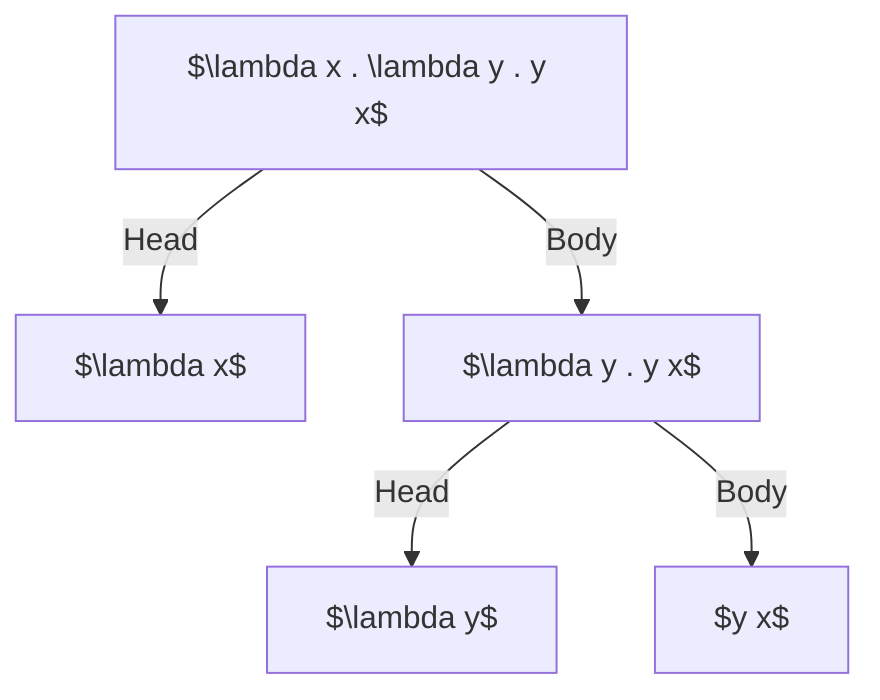

# Introduction

Lambda calculus, just like any other programming language out there is a programming language. In fact it's the simplest
programming language there is. It's even simpler than assembly.


Whenever we compare something, it must be in respect with some common property.
Saying one this is better than other, or one is easier than other is meaningless.


Lambda calculus is simpler than any language with respect to types of instructions available. Lambda calculus
has just two instructions :

- $\textbf{Abstraction}$ : An abstraction is very much like a `printf` statement in C. You create places that you can replace something with.
                Consider the format string `add = "(%d+%d)"`. This is a lambda abstraction to add two numbers.
                I'm just saying numbers, because _type information_ does not come naturally in lambda calculus. There is another branch
                of lambda calculus named "Typed Lambda Calculus".
- $\textbf{Application}$ : Application is analogous to replacing the _placeholders_ in the format with their corresponding stringified values.
                So, considering abstraction `add = "(%d+%d)`, when `(2, 3)` is applied to it, it'll look like `printf(add, 2, 3)` or,
                if we inline the `add` string, it'll look like `printf("(%d+%d)", 2, 3)`. The brackets are unnecessary though.
                
More on these later.


Calculus is when you just play with symbols without any actual computation or expression evaluation.


## The Language

Like any other programming language, lambda calculus has a grammar, which can be loosely written like this :

\\[
\begin{align}
\text{Expression} & ::= x \mid (\lambda x. M) \mid (M \ N) \\\\
\text{Variable} & ::= x, y, z, \dots \\\\
\end{align}
\\]

More precisely, it can be defined inductively as follows :

> DEFINITION[$\ ^{[1]}$](#references) : _Lambda_ terms are words over the following alphabet :  
> \\[
> \begin{aligned}
> & v_0, v_1, ... & variables, \\\\
> & \lambda & abstractor, \\\\
> & (\quad , \quad) & parenthesis
> \end{aligned}
> \\]
> 
> The set of lambda terms $\Lambda$ is defiend inductively as follows :
> 
> \\[
> \begin{align}
> x \ & \epsilon \ \Lambda; & \text{variable}\\\\
> M \ & \epsilon  \ \Lambda \rightarrow (\lambda x . M) \  \epsilon \  \Lambda; & \text{abstraction of M over x} \\\\
> M \ , \  N & \  \epsilon \ \Lambda \rightarrow (M N) \  \epsilon  \  \Lambda; & \text{application of M over N}
> \end{align}
> \\]

## Examples

- $xx$ is application of $x$ over $x$ (itself). This is like a constant term, $x$ already has a pre-defined value, and it cannot be changed.
- $\lambda x . x x$ is an abstraction over $x$ that applies $x$ to itself. Considering $xx$ as $M$, this can be re-written as $\lambda x . M$
- $\lambda x . x$ is called the identity abstraction or function.


Anything that comes after the $.$ (dot) is the body of that abstraction. This can get a bit messy later on when dealing with second or higher 
order abstractions.


An example of second order lambda abstraction : $\lambda x . \lambda y . y x$. We try to avoid using brackets in lambda abstractions
by convention. It's not invalid to re-write this abstraction as $\lambda x . (\lambda y . y x)$. When stuck in situations like these,
try to visualize these abstractions as follows :



Notice how anything that came after a $.$ (dot) is a body of abstraction over it's arguments.

The same abstraction can be re-written as $\lambda x y . y x$. The corresponding english translation will be :

> Take two lambda terms $x$ and $y$ and apply $y$ over $x$.

In code this might look like this :

```c
// functional programming in C 101
void l(void(*x)(), void(*y)(void(*)())) {
    y(x);
}
```

I guess this is why lambda calculus was created, to write programs faster :rofl:.

# Some Axioms Of Lambda Terms

\\[
\begin{align}
(\lambda x . M) N & = M[x := N]                                  & (\beta\text{-conversion}) \\\\
M                 & = M                                          & (\text{reflexivity}) \\\\
M = N             & \implies N = M                               & (\text{symmetricity}) \\\\
M = N, N = L      & \implies M = L                               & (\text{transitivity}) \\\\
M = N             & \implies MZ = NZ \\\\
M = N             & \implies ZM = ZN \\\\
M = N             & \implies \lambda x . M = \lambda x . N       & (\text{rule}-\xi)
\end{align}
\\]


There is no special meaning to any symbol you see, other than historical conventions. There is no
special meaning to $\beta$ or $\xi$ or $\lambda$, or any other symbol you see, until unless stated
otherwise.


Now notice how axioms $7$, $8$ and $9$ give another property to the language of lambda expressions.
Lambda terms hold equivalence relation over $=$ (conversion).


An equivalence relation is any relation $R$ that holds the following three properties over it's
domain :
- $aRa$ or reflexivity, meaning related to self.
- $aRb \implies bRa$ or symmetricity. It's like mirroring the relation about $R$.
- $aRb, bRc \implies aRc$ or transitivity. Think of it like a fluid flowing through two pipes having a common joint.
Fluid flowing through one point will surely reach another point given the fluid flow is unidirectional.


From what I know, an equivalence relation is really useful to break up a very large domain to smaller chunks,
if it has some special properties. These smaller sets of a bigger set are called [equivalence classes](https://en.wikipedia.org/wiki/Equivalence_class).
In an equivalence class, all objects are equivalent to each other, but not with other equivalence classes.

An easy to imagine example will be that of equilateral triangles and triangles similar to one with sides $(3, 4, 5)$
The set of equilateral triangles make an equivalence class of triangles, wherein each triangle is similar to the other,
but at the same time, none of it will be similar to any triangle that is similar to $(3, 4, 5)$. I think this relation of convertibility
can also be used to break the domain of all possible lambda expressions to smaller ones with similar properties.

The thing that I find interesting about lambda calculus is how logic appears out of combinations of terms. We can build all basic
logic gates by some very basic abstractions.

# Fixed Point Theorem

> $ \forall F \quad \exists X \mid FX = X $  
>
> For all lambda expression $F$, there exists another lambda expression $X$, such that $FX = X$, meaning when $F$ is 
> applied over $X$ we get $X$ (itself).

- Let's take $F = \lambda x . x$ (the identity abstraction), Then any lambda expression can take place of $X$.  
- Now consider $F = \lambda x . y$, then we have $X = y$, because $(\lambda x . y)y = y$.  
- If $F = \lambda x . xy$, then? Then can use $\lambda y . X$ as $X$ itself, because $FX = (\lambda x . xy)(\lambda y . X) = (\lambda y . X) y = X$.
- What if $F = \lambda x . xx$ then? We have $X = \lambda x . x$ or $X = I$ (the identity abstraction). Then $FX = FI = II = I$


I don't know whether these fixed points are unique or not.


## Proof

We basically need to prove existence of $X$ for all $F$. $F$ can be anything. If we can somehow devise
an algorithm to create such $X$s, then it'll make our task easier. 


Work In Progress. Going to do some other things, I'll come back to this.


# References

- [1] - Chapter 2 - Lambda Calculus, it's Syntax and Semantics - Henk P. Barendregt
