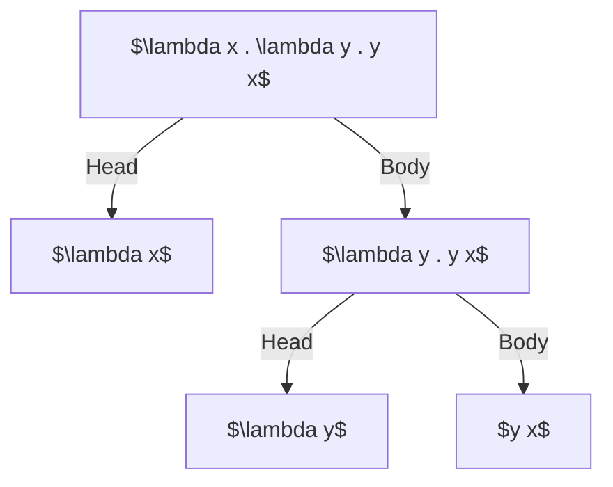

## Introduction

Lambda calculus, just like any other programming language out there is a programming language. In fact it's the simplest
programming language there is. It's even simpler than assembly.


Whenever we compare something, it must be in respect with some common property.
Saying one this is better than other, or one is easier than other is meaningless.


Lambda calculus is simpler than any language with respect to types of instructions available. Lambda calculus
has just two instructions :

- $\textbf{Abstraction}$ : An abstraction is very much like a `printf` statement in C. You create places that you can replace something with.
                Consider the format string `add = "(%d+%d)"`. This is a lambda abstraction to add two numbers.
                I'm just saying numbers, because _type information_ does not come naturally in lambda calculus. There is another branch
                of lambda calculus named "Typed Lambda Calculus".
- $\textbf{Application}$ : Application is analogous to replacing the _placeholders_ in the format with their corresponding stringified values.
                So, considering abstraction `add = "(%d+%d)`, when `(2, 3)` is applied to it, it'll look like `printf(add, 2, 3)` or,
                if we inline the `add` string, it'll look like `printf("(%d+%d)", 2, 3)`. The brackets are unnecessary though.
                
More on these later.


Calculus is when you just play with symbols without any actual computation or expression evaluation.


### The Language

Like any other programming language, lambda calculus has a grammar, which can be loosely written like this :

\\[
\begin{align}
\text{Expression} & ::= x \mid (\lambda x. M) \mid (M \ N) \\\\
\text{Variable} & ::= x, y, z, \dots \\\\
\end{align}
\\]

More precisely, it can be defined inductively as follows :

> DEFINITION[$\ ^{[1]}$](#references) : _Lambda_ terms are words over the following alphabet :  
> \\[
> \begin{aligned}
> & v_0, v_1, ... & variables, \\\\
> & \lambda & abstractor, \\\\
> & (\quad , \quad) & parenthesis
> \end{aligned}
> \\]
> 
> The set of lambda terms $\Lambda$ is defiend inductively as follows :
> 
> \\[
> \begin{align}
> x \ & \epsilon \ \Lambda; & \text{variable}\\\\
> M \ & \epsilon  \ \Lambda \rightarrow (\lambda x . M) \  \epsilon \  \Lambda; & \text{abstraction of M over x} \\\\
> M \ , \  N & \  \epsilon \ \Lambda \rightarrow (M N) \  \epsilon  \  \Lambda; & \text{application of M over N}
> \end{align}
> \\]

### Examples

- $xx$ is application of $x$ over $x$ (itself). This is like a constant term, $x$ already has a pre-defined value, and it cannot be changed.
- $\lambda x . x x$ is an abstraction over $x$ that applies $x$ to itself. Considering $xx$ as $M$, this can be re-written as $\lambda x . M$
- $\lambda x . x$ is called the identity abstraction or function.


Anything that comes after the $.$ (dot) is the body of that abstraction. This can get a bit messy later on when dealing with second or higher 
order abstractions.


An example of second order lambda abstraction : $\lambda x . \lambda y . y x$. We try to avoid using brackets in lambda abstractions
by convention. It's not invalid to re-write this abstraction as $\lambda x . (\lambda y . y x)$. When stuck in situations like these,
try to visualize these abstractions as follows :



Notice how anything that came after a $.$ (dot) is a body of abstraction over it's arguments.

The same abstraction can be re-written as $\lambda x y . y x$. The corresponding english translation will be :

> Take two lambda terms $x$ and $y$ and apply $y$ over $x$.

In code this might look like this :

```c
// functional programming in C 101
void l(void(*x)(), void(*y)(void(*)())) {
    y(x);
}
```

I guess this is why lambda calculus was created, to write programs faster :rofl:.

## Some Axioms Of Lambda Terms

\\[
\begin{align}
(\lambda x . M) N & \stackrel{\beta}{=} M[x := N]                                  & (\beta\text{-conversion}) \\\\
M                 & = M                                          & (\text{reflexivity}) \\\\
M = N             & \implies N = M                               & (\text{symmetricity}) \\\\
M = N, N = L      & \implies M = L                               & (\text{transitivity}) \\\\
M = N             & \implies MZ = NZ \\\\
M = N             & \implies ZM = ZN \\\\
M = N             & \implies \lambda x . M \stackrel{\eta}{=} \lambda x . N       & (\text{rule}-\xi)
\end{align}
\\]


There is no special meaning to any symbol you see, other than historical conventions. There is no
special meaning to $\beta$ or $\xi$ or $\lambda$, or any other symbol you see, until unless stated
otherwise.


Now notice how axioms $7$, $8$ and $9$ give another property to the language of lambda expressions.
Lambda terms hold equivalence relation over $=$ (conversion).


An equivalence relation is any relation $R$ that holds the following three properties over it's
domain :
- $aRa$ or reflexivity, meaning related to self.
- $aRb \implies bRa$ or symmetricity. It's like mirroring the relation about $R$.
- $aRb, bRc \implies aRc$ or transitivity. Think of it like a fluid flowing through two pipes having a common joint.
Fluid flowing through one point will surely reach another point given the fluid flow is unidirectional.


From what I know, an equivalence relation is really useful to break up a very large domain to smaller chunks,
if it has some special properties. These smaller sets of a bigger set are called [equivalence classes](https://en.wikipedia.org/wiki/Equivalence_class).
In an equivalence class, all objects are equivalent to each other, but not with other equivalence classes.

An easy to imagine example will be that of equilateral triangles and triangles similar to one with sides $(3, 4, 5)$
The set of equilateral triangles make an equivalence class of triangles, wherein each triangle is similar to the other,
but at the same time, none of it will be similar to any triangle that is similar to $(3, 4, 5)$. I think this relation of convertibility
can also be used to break the domain of all possible lambda expressions to smaller ones with similar properties.

The thing that I find interesting about lambda calculus is how logic appears out of combinations of terms. We can build all basic
logic gates by some very basic abstractions.

## Equivalence

When considering equivalence of two expressions, we can say they are equivalent in four ways

- $\alpha$-equivalence - Renaming of bound variables
- $\beta$-equivalence - Function application and reduction
- $\eta$-equivalence - Function extensionality
- syntactic equivalence

### Syntactic Equivalence

Two lambda expressions are $alpha$-equivalent if they differ only in the naming of
their variables. If we are to rename the variables, then it's we can them to look
identical.

#### Examples

- $\lambda x . x \stackrel{\alpha}{=} \lambda a . a$
- $\lambda x . x \stackrel{\alpha}{\not =} \lambda a . b$

### Beta ($\beta$) Equivalence

If we have $\lambda x . M$ and $N$ as two lambda expressions then the $\beta$-conversion
$(\lambda x . M)N \stackrel{\beta}{=} M[x:=N]$ is said to establish a $\beta$-equivalence
between the expressions $(\lambda x . M)N$ can be replaced by $M[x:=N]$ without changing the
meaning of original expression.

This is mathematics equivalent of the simplification process.

#### Examples :

- $(\lambda x . x + 1)3 \stackrel{\beta}{=} 3 + 1$
- $Iy \stackrel{\beta}{=} y$

### Eta ($\eta$) Equivalence

If two expressions always give same results when same input is provide to each, then
they're said to be $\eta$-equivalent.

#### Examples

- $\lambda x . F x \stackrel{\eta}{=} F$
- $\lambda x . yy \stackrel{\eta}{=} yy$ 

## Syntactic Equivalence

Two lambda expressions are syntactically equivalent when they are identical. All
the arrangement, ordering, naming, everything is exactly same. When this happens,
you can obviously replace one with the other without a doubt.

#### Examples

Consider the example $M \equiv \lambda x . Nx$. Now if we have another expression
like $(\lambda f . f x) M$ then we can replace $M$ in here with $\lambda x . Nx$
and rewrite the original expression as $(\lambda f . f x) M \stackrel{\beta}{=} M x \stackrel{\beta}{=} (\lambda x . Nx) x$
which upon applying further $\beta$-reductions, we can simplify to simple $Nx$

## Logic

Let's build some boolean login out of power of pure combinations. Unlike usual logic, we won't get
`true`/`false` as values. Here `true` and `false` are lambda abstractions itself.

- $\text{True} \stackrel{\beta}{=} \lambda xy.x$ - Meaning, take two values, and evaluate to only the first one.
- $\text{False}\stackrel{\beta}{=} \lambda xy.y$ - Take two, and evaluate to only the second one, discarding the first.

These are often called $\text{First}$ and $\text{Second}$ correspondingly for these reasons. So we can write
$\text{First} \equiv \text{True}$ and $\text{Second} \equiv \text{False}$.

### AND Gate

And of any two expressions is `true` if and only of both are `true` at the same time for same input, and is `false` otherwise.
In here, again to remind, we don't deal with values, but lambda expressions, so we need the $\text{True}$ or $\text{False}$
expression.

Defining $\text{AND} \stackrel{\beta}{=} \lambda ab . aba$. Let's try it out with some values

<center>

|       $a$      |       $b$      |    $\text{AND} a b$      |    b a$                    |     Result     |
|----------------|----------------|--------------------------|----------------------------|----------------|
| $\text{True}$  | $\text{True}$  | $\text{AND True True}$   | $\text{True True True}$    | $\text{True}$  |
| $\text{True}$  | $\text{False}$ | $\text{AND True False}$  | $\text{True False True}$   | $\text{False}$ |
| $\text{False}$ | $\text{True}$  | $\text{AND False True}$  | $\text{False True False}$  | $\text{False}$ |
| $\text{False}$ | $\text{False}$ | $\text{AND False False}$ | $\text{False False False}$ | $\text{False}$ |

</center>

Note how judiciously selecting value among $\text{First}$ or $\text{Second}$ helped us create an `AND` gate! Infact, if we can create `NAND` gate,
then we can derive very other gate from it, becuase `NAND` is a turing complete instruction. Try searching "from nand to tetris" in your favorite
search engine.

### OR Gate

This time we want it to return true whenever either of $a$ or $b$ is $\text{True}$. 
Defining $\text{OR} \stackrel{\beta}{=} \lambda ab . aab$.

<center>

|       $a$      |       $b$      |     $\text{OR} a b$     |       $a a b$              |     Result     |
|----------------|----------------|-------------------------|----------------------------|----------------|
| $\text{True}$  | $\text{True}$  | $\text{OR True True}$   | $\text{True True True}$    | $\text{True}$  |
| $\text{True}$  | $\text{False}$ | $\text{OR True False}$  | $\text{True True False}$   | $\text{True}$  |
| $\text{False}$ | $\text{True}$  | $\text{OR False True}$  | $\text{False False True}$  | $\text{True}$  |
| $\text{False}$ | $\text{False}$ | $\text{OR False False}$ | $\text{False False False}$ | $\text{False}$ |
</center>

### NOT Gate

A NOT gate will just flip the bits right? If it's $\text{True}$, it should evaluate to $\text{False}$, and if it's $\text{False}$,
it shoud evaluate to $\text{True}$. This is easier than what we've seen before. 
Defining $\text{NOT} \stackrel{\beta}{=} \lambda a . a \ \text{False} \ \text{true}$.

<center>

|        $a$     |   $\text{NOT } a$  |    $a \text{ False True}$    |     Result     |
|----------------|--------------------|------------------------------|----------------|
| $\text{True}$  | $\text{NOT True}$  | $\text{True False True}$     | $\text{False}$ |
| $\text{False}$ | $\text{NOT False}$ | $\text{False False True}$    | $\text{True}$  |

</center>

All of this is just from combinations of different selections performed. How about a bit more difficult gate then?
How about XOR gate?

### XOR Gate

This is true only when both values are different. Defining $\text{XOR} \stackrel{\beta}{=} \lambda ab . a (b \ \text{False} \ \text{True}) b$.

<center>

|       $a$      |       $b$      |   $\text{XOR} a b$       | $a (b \ \text{False} \ \text{True}) b$  |     Result     |
|----------------|----------------|--------------------------|-----------------------------------------|----------------|
| $\text{True}$  | $\text{True}$  | $\text{XOR True True}$   | $\text{True (True False True) True}$    | $\text{False}$ |
| $\text{True}$  | $\text{False}$ | $\text{XOR True False}$  | $\text{True (False False True) False}$  | $\text{True}$  |
| $\text{False}$ | $\text{True}$  | $\text{XOR False True}$  | $\text{False (True False True) True}$   | $\text{True}$  |
| $\text{False}$ | $\text{False}$ | $\text{XOR False False}$ | $\text{False (False False True) False}$ | $\text{False}$ |

</center>

If you see carefully, then in both the $\text{False}$ cases, taking not of $b$ is not really required, it can be anything there, but just to make it work
with both cases of $\text{True}$, it has to be there.

### If-Then-Else

If a condition is $\text{True}$, we execute the $\text{Then}$ case, otherwise, we execute the $\text{Else}$ case.
This is basically selecting the $\text{First}$ or $\text{Second}$ of $\text{Then Else}$. Writing program
for this is easy : $\text{ITE} \stackrel{\beta}{=} \lambda c t e . c t e$. If $c$ is $\text{True}$ then
$\text{ITE} cte$ will evaluate to $t$, and in the other case, it'll evaluate to $e$.


### Loops?

If you have some experience with The Haskell programming language, then you'd know that purely functional
languages don't have a way to iterate over some statements like Turing Machines do. Recursion is the only
way. So, we create loops using recursion. Let's try to build up the idea of how we can do recursion in
lambda calculus.


To be continued from here.


## Fixed Point Theorem

> $ \forall F \quad \exists X \mid FX = X $  
>
> For all lambda expression $F$, there exists another lambda expression $X$, such that $FX = X$, meaning when $F$ is 
> applied over $X$ we get $X$ (itself).

- Let's take $F = \lambda x . x$ (the identity abstraction), Then any lambda expression can take place of $X$.  
- Now consider $F = \lambda x . y$, then we have $X \equiv y$, because $(\lambda x . y)y = y$.  
- If $F = \lambda x . xy$, then? Then can use $X \stackrel{\beta}{=} \lambda y . X$, because $FX \equiv (\lambda x . xy)(\lambda y . X) \stackrel{\beta}{\rightarrow} (\lambda y . X) y \stackrel{\beta}{\rightarrow} X$.
- What if $F = \lambda x . xx$ then? We have $X \stackrel{\beta}{=} \lambda x . x$ or $X \stackrel{\eta}{=} I$ (the identity abstraction). Then $FX = FI = II = I$.


These fixed points are not unique. Consider the lambda expression $F \stackrel{\beta}{\=} \lambda x . x$. Take any $X$ and, it'll be
a fixed point of this.



Proofs for the fixed point theorem already exist. I do not understand the proofs right now, becuase I feel I
need more familiarity with lambda calculus. I'll come back to this once I feel confident to prove this myself.
I know for now that the key to proving this is recursion. I'm figuring out how can we do recursion in lambda
calculus.


## References

- [1] - Chapter 2 - Lambda Calculus, it's Syntax and Semantics - Henk P. Barendregt
