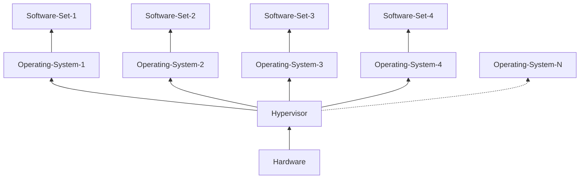
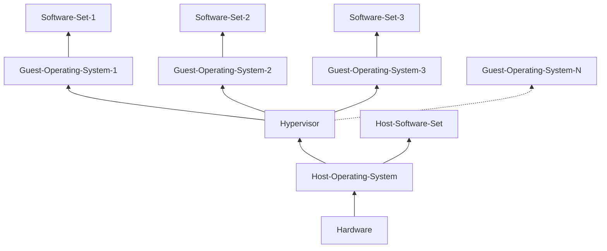

## Background

I already have some experience with developing an Operating System. This was about three years ago, from
the time of writing. I soon realized that doing this won't be easy, and it'll quickly take up all my college
years and I won't be able to explore other areas because of that. Nevertheless, it is a fun endeavour.

This time, I'm free from college, and working as a freelancer, and have some time free that I often spend
doom scrolling. I'm now trying to learn about how to write hypervisors, and probably spend some time experimenting
and diving deeper this time. I realize I have now improved my development skills and that just might come in handy.
Another reason (or the primary reason) to learn about hypervisors by writing one by myself is becaue I recently got
an interview opportunity in a startup that I really want to get in, and hence this will be a good preparation for me.

When I wrote my operating system, I used already existing, well tested, community reviewed and maintained bootloaders,
but this time I'm planning to write that one by myself as well. Since we're going baremetal, let's make it a bit more
challenging. Writing the bootloader itself won't be that easy, because we're targeting ARM, and each ARM device differs
a lot from each other. This means you might need to explicitly support the ARM device that you're targeting, unlike writing
one code for x86 and expecting very few changes. And to be honest, don't listen to me right now, because I have almost zero
experience with ARM architecture, even though I do use it as my daily go to machine.

> For QEMU’s Arm system emulation, you must specify which board model you want to use with the -M or --machine option;
> there is no default.
>
> Because Arm systems differ so much and in fundamental ways, typically operating system or firmware images intended
> to run on one machine will not run at all on any other. This is often surprising for new users who are used to the
> x86 world where every system looks like a standard PC. (Once the kernel has booted, most userspace software cares
> much less about the detail of the hardware.)
> 
> -- [qemu arm system emulator documentation](https://www.qemu.org/docs/master/system/target-arm.html)

Attentive/Experienced readers might notice the reason for me quoting the doc here. In x86, the default machine is 
[`q35`](https://wiki.qemu.org/Features/Q35), but here for ARM, we don't have a default one. Not really relevant at
this point, but just something I found odd, as the doc says.

## Hypervisor

In this (series of) post(s), we're going to write a bare-metal hypervisor for ARM Cortex-A72 architecture
and in the end try to run it on a real Raspberry Pi 4 Model B (R-Pi4-ModelB). It's not going to be an easy
task, because of lack of resources you can find, as compared to X86, an architecture with mixed feelings.  

There are two types of hypervisors :

- Type 1 : Bare metal. These can run directly without an operating system. Examples include Xen, KVM, etc...
- Type 2 : These run on a Host OS. An example is VirtualBox, Parallels Desktop, etc...

Above is a diagram showing placement of Hypervisor in between hardware and operating systems. As one can imagine,
this is best for cloud servers, that do not require a host OS, and just launch virtual machine instances.

Above is a diagram showing placement of Hypervisor between Host OS, and Guest OS. A guest OS is another operating
system that you install and run along with Host OS. I remember discovering the idea of virtualization software when
looking for alternatives of dual boot, very very long time ago. I think I was in my High School.

## Raspberry Pi 4 Model B

Even though this series follows R-Pi4-ModelB (ARM Cortex-A72), I think you can take this as reference when working with any other ARM
board. We'll not be interacting with real hardware from the beginning as that can be really really hard to debug. Qemu
really helps here, and we must really appreciate this well maintained piece of software for this. Qemu has support for
various [ARM board types](https://www.qemu.org/docs/master/system/target-arm.html#board-specific-documentation).

I do also have a physical Raspberry Pi with me, which I often use as my Linux server with ARM architecture.

  

## How To Read?

I'll make sure to quote certain parts of documentations and from where I found those. An example of this can look like
the following text :

> The Cortex-A72 processor implements the ARMv8-A architecture. This includes:
> 
> - Support for all the Exception levels, EL3-EL0.
> - Support for both Execution states, AArch64 and AArch32, at each Exception level.
> - The following instruction sets:
>     - __AArch64 Execution state__
>         - The A64 instruction set.
>     - __AArch32 Execution state__
>         - The T32 and
>         - A32 instruction sets.
> 
> -- Section 3.1 of [ARM Cortex-A72 Technical Reference Manual](/documents/manuals/processors/arm/cortex-a72/cortex_a72_mpcore_trm_100095_0003_06_en.pdf)

These quotes might make the text a bit noisy, but will also help you by providing required information then and there.

## Bootloader

Our execution will start from bootloader. The bootloader will jump to hypervisor code, which can eventually jump to a kernel (if there is one),
or a program that you want to directly execute. Unlike x86 based systems, where BIOS jumps to a specific address to execute bootloader code,
in Raspberry Pi and other ARM based systems as well, there are unique ways of defining boot configuration options. Since I'm learning embedded
programming, and hypervisor development at the same time, finding this information took some time. Coming from years of usage of x86, I was under
the impression that I just need to find that address where BIOS jumps to, to execute next step in the boot process. I guess this is what they mean
when they say

> You have to un-learn first to learn

I must forget whatever I know about x86 systems, and learn fresh without assuming things.

> In AArch64, the processor starts execution from an `IMPLEMENTAION-DEFINED`
> address, which is defined by the hardware input pins `RVBARADDR` and can be read by
> the `RVBAR_EL3` register. You must place boot code at this address
>
> -- 5.1.1 at [A Baremetal Boot Code For ARMv8-A Processors](/documents/manuals/processors/arm/cortex-a72/DAI0527A_baremetal_boot_code_for_ARMv8_A_processors.pdf)

Even finding this baremetal boot code document took whole day yesterday, some frustration and then finally the bliss.
Unlike last time, I will try my best to just follow documentation, and learn how to use documentation to do the programming,
and won't try to follow any existing code resources.  
Now, since each board has it's own implementation, we have to keep an eye for this `IMPLEMENTATION-DEFINED` keyword. In
other words, you will have to read and understand links between to separate documentation. One documentation for the board you are using, and
another for the ARM processor you are using.
For us, we need to refer to the Raspberry Pi documentation. I looked it up, [and found this](https://www.raspberrypi.com/documentation/computers/config_txt.html#what-is-config-txt) :

> Instead of the BIOS found on a conventional PC, Raspberry Pi devices use a configuration file called `config.txt`. 
> The GPU reads config.txt before the Arm CPU and Linux initialise. Raspberry Pi OS looks for this file in the boot partition,
> located at `/boot/firmware/`.

So as I mentioned, I was looking for wrong things, to do the right thing, and it took time, because the wrong thing didn't exist in the documentation.
This `config.txt` is even better than having to configure a BIOS. I can configure it from my development lab and then push it to raspberry pi for execution.

### [Boot Sequence](https://www.raspberrypi.com/documentation/computers/raspberry-pi.html#eeprom-boot-flow)

Before we can start writing any OS or Hypervisor, it's a good idea ot gather some information about the boot sequence of the board you are on.
I'm not only talking about Raspberry Pi boards, bust just any other board, be it a PandaBoard, a BeagleBoard, or your Mother ...Board :wink:.
It is therefore very very important to read documentation about the board you're developing on. In my case it's Raspberry Pi, here's the [documentation](https://raspberrypi.com/documentation)

Since Raspberry Pi 4, Raspberry Pi flagship devices use an `EEPROM` bootloader. The main difference between these and previous products is that
the second-stage bootloader is loaded from SPI flash `EEPROM` instead of the `bootcode.bin` file used on previous products.

#### [First Stage Bootloader](https://www.raspberrypi.com/documentation/computers/raspberry-pi.html#first-stage-bootloader)

The boot flow for the ROM (first stage) is as follows:

TODO draw graph here to explain more easily

- SoC powers up
    - Read OTP to determine if the `nRPIBOOT` GPIO is configured
    - If `nRPIBOOT` GPIO is high or OTP does NOT define `nRPIBOOT` GPIO
        - Check OTP to see if recovery.bin can be loaded from SD/EMMC
            - If SD `recovery.bin` is enabled then check primary SD/EMMC for `recovery.bin`
                - Success - run `recovery.bin` and update the SPI EEPROM
                - Fail - continue
        - Check SPI `EEPROM` for second stage loader
            - Success - run second stage bootloader
            - Fail - continue
    - While True
        - Attempt to load `recovery.bin` from USB device boot
            - Success - run `recovery.bin` and update the SPI `EEPROM` or switch to USB mass storage device mode
            - Fail - retry USB device boot

For us, the second stage will not be executed. GPIO is disabled by default.


recovery.bin is a minimal second stage program used to reflash the bootloader SPI `EEPROM` image.


#### [Second stage bootloader](https://www.raspberrypi.com/documentation/computers/raspberry-pi.html#second-stage-bootloader)

This section describes the high-level flow of the second stage bootloader.

- Initialise clocks and SDRAM
- Read the `EEPROM` configuration file
- Check `PM_RSTS` register to determine if `HALT` is requested
    - Check `POWER_OFF_ON_HALT` and `WAKE_ON_GPIO` `EEPROM` configuration settings
    - If `POWER_OFF_ON_HALT` is 1 and `WAKE_ON_GPIO` is 0 then
        - Use PMIC to power off system
    - Else if `WAKE_ON_GPIO` is 1
        - Enable fall-edge interrupts on GPIO3 to wake-up if GPIO3 is pulled low
    - Sleep
- While True
    - Read the next `boot-mode` from the `BOOT_ORDER` parameter in the `EEPROM` config file.
    - If `boot-mode` == RESTART
        - Jump back to the first `boot-mode` in the `BOOT_ORDER` field
    - Else if `boot-mode` == STOP
        - Display start.elf not found error pattern and wait forever.
    - Else if `boot-mode` == SD CARD
        - Attempt to load firmware from the SD card
            - Success - run the firmware
            - Failure - continue
    - Else if `boot-mode` == NETWORK then
        - Use `DHCP` protocol to request IP address
        - Load firmware from the `DHCP` or statically defined `TFTP` server
        - If the firmware is not found or a timeout or network error occurs then continue
    - Else if `boot-mode` == USB-MSD or `boot-mode` == `BCM-USB-MCD` then
        - While USB discover has not timed out
            - Check for USB mass storage devices
            - If a new mass storage device is found then
                - For each drive (LUN)
                    - Attempt to load firmware
                        - Success - run the firmware
                        - Failed - advance to next LUN
    - Else if `boot-mode` == NVME then
        - Scan PCIe for an NVMe device and if found
            - Attempt to load firmware from the NVMe device
                - Success - run the firmware
                - Failure - continue
    - Else if `boot-mode` == RPIBOOT then
        - Attempt to load firmware using USB device mode from the USB OTG port - see USB boot. There is no timeout for RPIBOOT mode.

### [Boot Folder Contents](https://www.raspberrypi.com/documentation/computers/configuration.html#boot-folder-contents)

For R-Pi4-ModelB, the `boot` partition is mounted at `/boot/firmware`. This might be just the `/boot` folder if you're on older boards.
Read the documentation. Also, R-Pi4 and R-Pi5 both come with a default configurable bootloader and are installed in on-board `EEPROM`.
`EEPROM` stands for Electrically Erasable Programmable Read-Only Memory. Once you write to this memory, the written contents stay there
even after a power reset, unlike RAM.  

> Since Raspberry Pi 4, Raspberry Pi flagship devices use an `EEPROM` bootloader. The main difference between these and previous products is
> that the second-stage bootloader is loaded from SPI flash `EEPROM` instead of the `bootcode.bin` file used on previous products.

Is it possible to use our own bootloader then? YES! Should we write one of our own? I don't know, let's see...

> [`recovery.bin`](https://www.raspberrypi.com/documentation/computers/raspberry-pi.html#recovery-bin)
>
> At power on, the ROM found on `BCM2711` and `BCM2712` looks for a file called `recovery.bin` in the root directory of the boot partition on the SD card.
> If a valid `recovery.bin` is found then the ROM executes this instead of the contents of the EEPROM. This mechanism ensures that the bootloader
> flash image can always be reset to a valid image with factory default settings.

Note that R-Pi4-ModelB has `BCM2711` as SoC.

> kernel is the alternative filename on the boot partition for loading the kernel. The default value on the Raspberry Pi 1, Zero and Zero W, 
> and Raspberry Pi Compute Module 1 is kernel.img. The default value on the Raspberry Pi 2, 3, 3+ and Zero 2 W, and Raspberry Pi Compute Modules
> 3 and 3+ is kernel7.img. 
>
> The default value on the Raspberry Pi 4 and 400, and Raspberry Pi Compute Module 4 is kernel8.img, or kernel7l.img if arm_64bit is set to 0.
> 
> The Raspberry Pi 5, Compute Module 5, and Raspberry Pi 500 firmware defaults to loading kernel_2712.img because this image contains optimisations
> specific to those models (e.g. 16K page-size). If this file is not present, then the common 64-bit kernel (kernel8.img) will be loaded instead.
