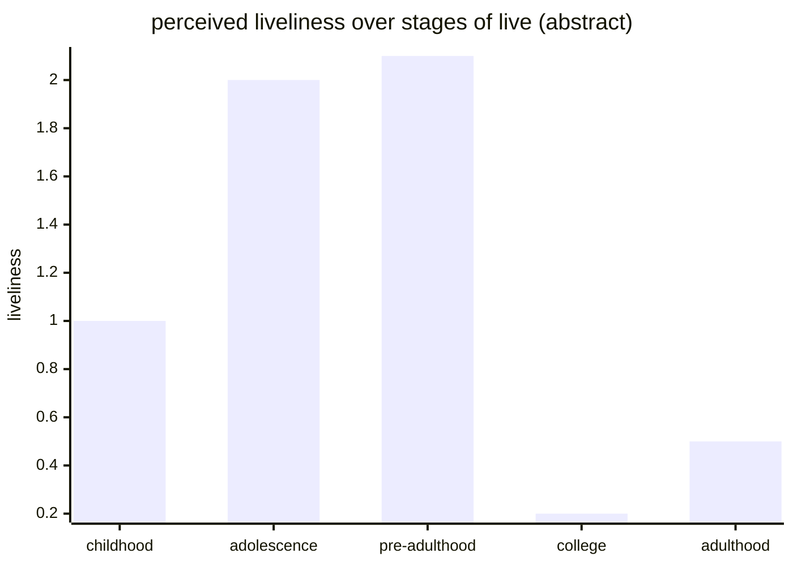
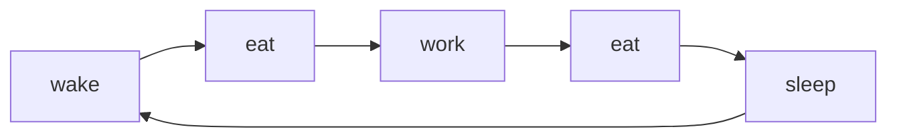


This post is about self reflection, and methods I think (will/are) work(ing) for me. Mental health is a serious thing, which you should not try addressing on your own.
If you or someone you love is struggling with some issues, consider contacting a therapist. Please don't consider anything in here as mental health advice! I study
computer science, not medical science! Health is wealth :-)


# Reflections

## Childhood

Imagine childhood, you were new to this world with so many things to explore, and you knew nothing about anything, so you wanted to explore everything in your surrounding.
From things like breaking really costly things in the house, just to know what happens, to just wandering off to somewhere, slowly adding one to the stack of forehead wrinkles the parents
are going to have as they grow with us.

I don't remember really getting bored at all, because I always had some questions in my mind about the things/places near me. Sometimes this was a nearby pond, sometimes it was
a dead battery, trying to see if I can make firecrackes out of it, sometimes it was just different liquids in the house (like oils, spirits, washing-liquids, etc...)
wanting to know "What will happen if I mix these together?", "Will I end up making a new thing?"

When I used to get bored, I would find a torch in the house, take out it's glass and see if I can start a fire. Hell, I did start a fire in my house once when I was waay young,
maybe 5 or 6 years old. I remember wanting to see "What happens when I burn a thread?", and what I didn't realize was the thread was hanging on a bedsheet (this was a separate
thread I took out of my Mother's set of threading tools). I also remember getting beaten really hard that day, but Mothers are superheroes, saving the day for me :-) And then
everybody laughed at the foolishness, but for me it was a good experiment, and the results were really impactful!

## Adloescence

Growing up, My interactions with technology started increasing year by year. I got a computer and then I had a single place to focus all my energy to. There was internet that
could answered almost anything I wanted to know. There were games! Games!!! Best playground to try "What will happen if I do this?". Since computer, I slowly stopped trying any
other playground. No more real life experiments. Most of it was about trying to find how I can make a game. Writing a local html website to showcase all games and media on my PC.

Later down the line however my PC got sold and I invested a good amount of time in Mathematics & Physics. Man that was a really good time! First it started with FOMO (fear-of-missing-out),
where my peers joined coaching classes, and they were learning advanced sounding stuffs like derivatives, vectors, differentiation, etc... Luckily I got my hands on some senior year books,
and I started banging my head as well. In my opinion that (2016-2018) was one of the golden ages of my life (probably most of us). That was the time of digitization, freedom, curiosity and discovery.
That was the time when I was introduced with "ulimited internet" (which is not really ulimited as I learned down the line).

I remember skimming through whole of Sal Khan's lectures on multivariable calculus in just one single night. That was not even my syllabus! Heck! Who cared about syllabus anymore, I was having
serious fun. I was feeling intelligent (even though most of it was shallow knowledge, it was something to me). This completely new dimension of thinking opened up to me and there was no way
a school syllabus was going to stop me from discovery. It was an obsession so hard that I almost failed my Social Sciences exam, because I was (trying) to read a
Quantum Mechanics book I had. All of my peers and teachers thought that I was only a show off.



There were some other social aspects of this behavior as well, which is not really the point of this post, the point where I'm trying to lead us to.

## Pre-Adulthood

Enter senior secondary, and I have a new laptop, and this time I started learning programming. I was absolute fun! Type in a few lines of code, and look at the output. It started with
trying to solve some CodeChef challenges, then that started feeling too repetitive, and then I found this really really really amazing video by [CodeBullet](https://youtu.be/3bhP7zulFfY),
where he showcases an AI he built for playing a Snake game he made! This was absolutely crazy for me, and I JUST HAD TO DO THIS! Then I began searching on how I can write my own AI. I constrained
myself to writing things from scratch. So, I found some resources, wrote a very shitty AI, and wrote a really awesome Snake AI game and I was just having a blast doing all of this. This was
really _challenging_ for me. This kept on going! I then went on to learn lower level stuffs, like assembly, reverse engineering, I played some CTFs, made some friends, I wrote lots of code
to experiment, sometimes small graphics programs, attempts to write engines, operating systems, full fledged softwares to do something that i really didn't think about but was just too _bored_
to do nothing. I was _bored_!

I was bored for the first time in my life.

## College

Entering my adulthood, slowly running out of options to explore! Or maybe I just never thought about any of this as exploration. All of the amusings I had with my learnings, explorations,
all of it was natural, so no thought was put into it. Now I was just stuck in this downward loop of trying to find excitement in doing the same things! Never in my life before, had my study syllabus
matched what I had to learn. I already had a pretty good headstart with programming, and maths, other subjects I didn't really care about (I am a maths major).

This life stage is a spiral because I was stuck in same repetitive loops! The exploration part was very little! And all of this, being constantly stuck in this loop, was leading to more and more
boredom.

# The Liveliness Graph!

Consider an ad-hoc metric to capture the liveliness of your live during a period of time :

$$ \text{liveliness} = \text{some function}(\frac{\text{time passed}}{\text{time experienced}}) $$

So, basically if $ \text{time passed} > \text{time experienced} $, you're focused and enjoying your time, you're more live, and if $ \text{time passed} < \text{time experienced} $ you're most probably not enjoying.
Almost always $ \text{time passed} \ne \text{time experienced} $ in my experience.

Using this metric, this is my liveliness

To be honest I think I've been chronically bored since I entered my third semester of college. I did feel that something was off, but I think I just didn't have enough data to pin-point a root
cause of the issue. Now I do have enough data!

# Out Of College

Ok, so after having bored the hell out of my life, I realized I have to quit college! I was already doing quite good back then in terms of career. I had a contract, that seems to be going good,
I made some good connections there, and I had plan for the future, and there was literally no point in continuing, so I took my Honors degree (I was enrolled in a 3+2 course, and I exited out in fourth year,
my course had early exit option with an Honors degree in Mathematics) and started working from home. At this point of time I did realized that there was _monotonicity_ in my life. Everything was just
too regular for me.

Almost all of this time was spent at home, basically stuck in the same loop again.

Boredom! In hopes of escaping, still not realizing the root cause, again stuck with it!

# Now!

This is a completely different stage of life! It's like I was somehow pulled out of that state slowly and slowly. I moved places, I switched careers (now pursuing a PhD), I was forced to explore
by some unseen force.



I was forced to cook, to do things other than just programming whole day. I went on hikes, climbing, ice skating, etc... the list is now growing and will keep growing. A bucket list so large!

# Hypothesis

Now that I have enough data, and slowly am building a scientific temperament as well, I realize the core of the issue. As soon as I entered college, I stopped challenging myself. The courses were quite easy,
exams were easy, everything was just too un-challenging, and me not realizing that self-challenge is what has kept me going all those years, I stopped finding new challenges for me!. So, taking all this into
account, here's the hypothesis :

> The cure to boredom is self-challenge

Challenging yourself in new ways to keep exploring. The key component is to build a faculty that makes you realize that you've stopped exploring, or maybe your exploration speed is just too slow for your brain.
I've noticed that I get bored only when that liveliness score gets low. That liveliness score gets low because the denominator in the formula is going above a bar.

There's a popular line by a famous actor in India [Rajesh Khanna](https://en.wikipedia.org/wiki/Rajesh_Khanna)

that goes like

> ... Babumoshai, zindagi badi honi chahiye ...  
> lambi nahi!

Translation :

> ... My dear sir, life should be big ...  
> not long!



That perceived time is largely dependent on how challenged you feel. I'd however also assume that suddenly raising the bars might also cause [_learned helplessness_](https://en.wikipedia.org/wiki/Learned_helplessness)
and we must train faculties to detect these traps before they start showing their effects.

# Conclusion

In conclusion, challenge/expose yourself in ways you've never done before. That is also the main reason _I think_ for [doom-scrolling](https://en.wikipedia.org/wiki/Doomscrolling). Your faculties acting up
to force you to find out things to do, but because of the design of the whole doom-scrolling setup, you mostly can just watch, and not do anything, slowly teaching you that all you can do, and must do is watch!
Which now many people are already aware is a downward spiral of it's own!

Sometimes this _challenge/exposure_ to self also manifests itself out of (or as a consequence of) motivation acquired after achieving something (a sense of achievement).
You unknowingly ask yourself can I do this again? Let's find out! This is why you'll get recommended about making small achievements, like cleaning your place,
taking a shower, reading a book, etc...

## Focus

Medical science also suggests that boredom is partly due to lack of focus. In my case I realize I can stay focused for hours if I'm working on something that I
find interesting. This is the case with many as I've seen in my life. The good thing is focus can be built by embracing boredom! Try to wait it out, sit, medidate,
force yourself out of your comfort zone.

## Induced Pressure

I've realized that sometimes, a controlled induced pressure, like using a deadline to get things done make things less boring. Because you're basically forcing the the time parameters
to go smaller, also you give your brain less time to get distracted on other stuff. This is also probably why completing whole syllabus the night before exam just works! This induced pressure
has to be controlled, just so that it does not turn into stress.

## It's Not Always Direct

Forcing yourself out of comfort zone is not always direct/easy. Forcing a deadline on yourself is not easy as well. Another important observation I've made about my behavior,
is that if you chain actions, to make it feel as if starting to get a thing done is easy, it just works! Sometimes it requires pre-planning, like preparing your uniform a night before,
meal prep, grocery shopping on weekends, and sometimes it just requires a different perspective, like me preparing a cup of chai for myself to push me out of bed, and then slowly convincing
myself to cook some food.

## Its Only A Hypothesis

In a few years I'll have more data, and then I guess I can support The Hypothesis more! See you next time ;-)
