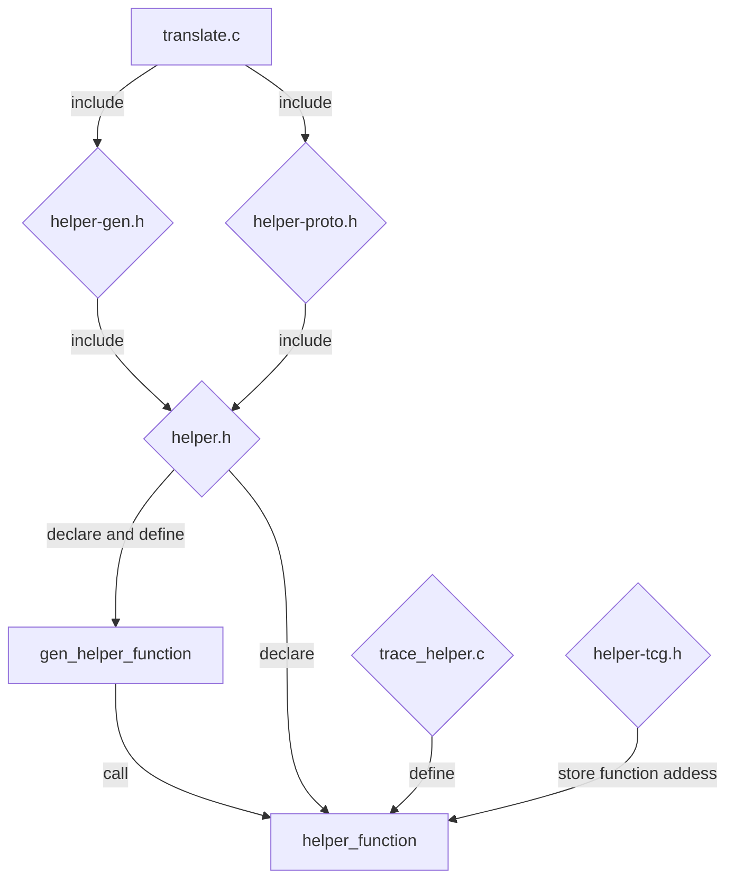
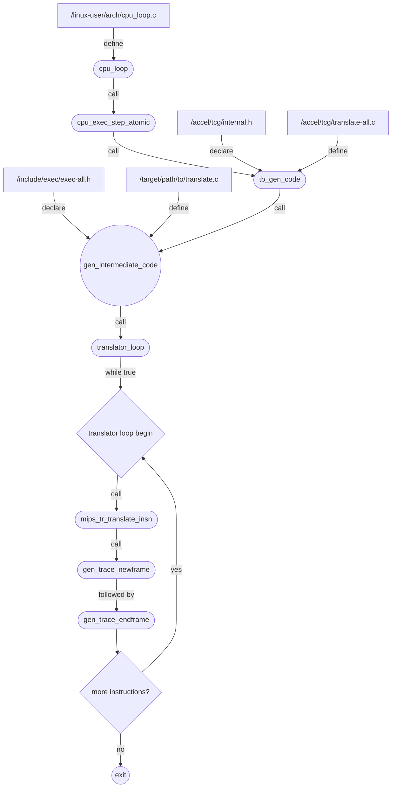

# BAP MIPS Trace Testing Support

I've been tasked to add mips support for trace testing in BAP. These are my notes while trying to learn how to add support for MIPS. Since there's already support for some other architectures, I'll take reference from their pull requests :
- [ARM Support](https://github.com/BinaryAnalysisPlatform/qemu/pull/19)
- [PPC Support](https://github.com/BinaryAnalysisPlatform/qemu/pull/20)
- [X86 Support](https://github.com/BinaryAnalysisPlatform/qemu/pull/21)

There are very few PRs in BAP's Qemu repository. I'll use these three PRs as a reference by looking at their diffs and try to understand what and why of additions and deletions. It's almost like a reverse engineering task, just that here I'm provided with direct source code :) Let's begin!

# What is BAP?

BAP (Binary Analysis Platform) as I've mentioned in some of my previous posts, especially in [RzIL Notes](https://brightprogrammer.in/2023/04/11/RzIL-Introductory-Notes/), is a framework written for binary analysis. It has it's own modified version of OCaml language that's used to write their modules. Anyone can write a binary analysis module using BAP! They have a nice, one and only but extensive tutorial [here](https://github.com/BinaryAnalysisPlatform/bap-tutorial).

# Why Do We Care?

Rizin's RzIL uses BAP's intermediate language (Core Theory) as a reference. Now, just like any other IL used for analyzing a binary, we need to write uplifters for it. ESIL (Evaluable Strings & Intermediate Language), which is Radare's and Rizin's very old intermediate language also has uplifters as you'll see in [`/librz/analysis/p`](https://github.com/rizinorg/rizin/tree/dev/librz/analysis/p) folder for different architecture. That folder is basically contains lots of plugins for different architectures. 

Wanna analyze a custom VM obfuscator in a CTF? write easy uplifter for it in Rizin and you'll be able to analyze it in Rizin itself! You can create uplifter for a simple VM with around 20 instructions in about 200 SLOC in C. Most of the code is repetitive, you'll be just copy pasting the code for each function and mostly be modifying the arguments and internal operation. 

What do you get in return? You get call graphs, functions, variables etc... almost every feature that is provided by Rizin for any other architecture.

# Testing Intermediate Languages.

It's because RzIL is based on Core Theory, we need to follow similar steps, that it (core theory) uses to verify whether it's uplifted correctly or not? BAP has something called [trace frames](https://github.com/BinaryAnalysisPlatform/bap-frames/) that it uses to check whether the execution inside BAP's VM and actual PC matches or not. This involves recording of read/write events, storing some discernible CPU information after each instruction's execution. As far as I know, ESIL didn't use executiont traces to verify their uplifted code, but they do organize [R2Wars](https://rada.re/con/2021/#r2wars), where they ask participants to write bots in any assembly language that ESIL supports and then they execute them in a same memory region. Bot that executes for longer time will win! (I built something like that, checkout [XWars](https://github.com/X3eRo0/xwars) if you're interested in the idea)

Same is the case with RzIL. Rizin has a VM that executes RzIL code. It can be found in [`/librz/il`](https://github.com/rizinorg/rizin/tree/dev/librz/il). We need to verify the execution by comparing it with traceframes. Rizin has built a small tool [rz-tracetest](https://github.com/rizinorg/rz-tracetest) to do the following : 
- Load a binary
- Ask Rizin to uplift it to RzIL
- Execute instructions
- Compare register values after each instruction
- Compare what events were executed?
- Repeat until execution finishes.

In the end you get a small table that shows misexecutions, successful executions, incorrect ones etc...

Not only this, Rizin also has per instruction fuzz testing that's implemented using their own `rz-test` tool! But more on that in some other post because I haven't started it yet.

# How To Generate Traces?

BAP uses a modified version of [Qemu](https://github.com/BinaryAnalysisPlatform/qemu/) to create these traces. First you need installed bap and bap-frames OCaml package. Then you can build this from their GIT repository by specifying the bap-frames directory. 

After building you can do `qemu-system <options> <program>` to generate generate `<program>.frames` file for given program. This can now be used to do trace testing.

# Internal Modifications To Create Traces

This section is where actual notes start. Here we go down the rabbit hole to take a look at how everything works!

We begin with defining helpers in file named `trace_helper.h` or `helper.h` or anything similar. The signature
of helpers is something like this (you can just ripgrep them instead of searching the files) : 
```c
DEF_HELPER_X(function_name, return_type, x_number_of_arguments...)
// examples
DEF_HELPER_1(trace_newframe, void, i32) // 1 argument
DEF_HELPER_2(trace_do_something_else, void, i32, i32) // 2 arguments
DEF_HELPER_3(trace_something_more, void, i32, i32, i32) // 3 arguments
```

Let's take a look at how they are defined in `/include/exec/helper-head.h` :

```c

#define DEF_HELPER_0(name, ret) \
    DEF_HELPER_FLAGS_0(name, 0, ret)
#define DEF_HELPER_1(name, ret, t1) \
    DEF_HELPER_FLAGS_1(name, 0, ret, t1)
#define DEF_HELPER_2(name, ret, t1, t2) \
    DEF_HELPER_FLAGS_2(name, 0, ret, t1, t2)
.
.
.
```

Then `DEF_HELPER_FLAGS_N` is defined as in following files : 



<!-- tab helper-gen.h -->
```c
// in helper-gen.h
#define DEF_HELPER_FLAGS_0(name, flags, ret)                            \
static inline void glue(gen_helper_, name)(dh_retvar_decl0(ret))        \
{                                                                       \
  tcg_gen_callN(HELPER(name), dh_retvar(ret), 0, NULL);                 \ <--- notice this
}

#define DEF_HELPER_FLAGS_1(name, flags, ret, t1)                        \
static inline void glue(gen_helper_, name)(dh_retvar_decl(ret)          \
    dh_arg_decl(t1, 1))                                                 \
{                                                                       \
  TCGTemp *args[1] = { dh_arg(t1, 1) };                                 \
  tcg_gen_callN(HELPER(name), dh_retvar(ret), 1, args);                 \ <--- notice this
}

#define DEF_HELPER_FLAGS_2(name, flags, ret, t1, t2)                    \
static inline void glue(gen_helper_, name)(dh_retvar_decl(ret)          \
    dh_arg_decl(t1, 1), dh_arg_decl(t2, 2))                             \
{                                                                       \
  TCGTemp *args[2] = { dh_arg(t1, 1), dh_arg(t2, 2) };                  \
  tcg_gen_callN(HELPER(name), dh_retvar(ret), 2, args);                 \ <--- notice this
}
.
.
.
```
<!-- endtab -->

<!-- tab helper-proto.h -->
```c
// in helper-proto.h
#define DEF_HELPER_FLAGS_0(name, flags, ret) \
dh_ctype(ret) HELPER(name) (void);

#define DEF_HELPER_FLAGS_1(name, flags, ret, t1) \
dh_ctype(ret) HELPER(name) (dh_ctype(t1));

#define DEF_HELPER_FLAGS_2(name, flags, ret, t1, t2) \
dh_ctype(ret) HELPER(name) (dh_ctype(t1), dh_ctype(t2));
.
.
.
```
<!-- endtab -->

<!-- tab helper-tcg.h -->
```c
// in helper-tcg.h
#define DEF_HELPER_FLAGS_0(NAME, FLAGS, ret) \
  { .func = HELPER(NAME), .name = str(NAME), \
    .flags = FLAGS | dh_callflag(ret), \
    .typemask = dh_typemask(ret, 0) },

#define DEF_HELPER_FLAGS_1(NAME, FLAGS, ret, t1) \
  { .func = HELPER(NAME), .name = str(NAME), \
    .flags = FLAGS | dh_callflag(ret), \
    .typemask = dh_typemask(ret, 0) | dh_typemask(t1, 1) },

#define DEF_HELPER_FLAGS_2(NAME, FLAGS, ret, t1, t2) \
  { .func = HELPER(NAME), .name = str(NAME), \
    .flags = FLAGS | dh_callflag(ret), \
    .typemask = dh_typemask(ret, 0) | dh_typemask(t1, 1) \
    | dh_typemask(t2, 2) },
.
.
.
```
<!-- endtab -->



Another macro, ok, this is the last one : 

```c
// glue just concatenates helper_ and name together like helper_name
// eg: HELPER(newframe) will generate the name helper_newframe
#define HELPER(name) glue(helper_, name)
```

Also, take a look at [`dh_ctype` definition](https://github.com/BinaryAnalysisPlatform/qemu/blob/f1f0761ae79da64b5ecd9cc32d165f94e2fcf9a2/include/exec/helper-head.h#L38) if you're curious, its not much, it just evaluates to one of the `ctypes`

<!--  -->

Which one of those above defined helper macros will be expanded depends on which header they include. Let's take a look.


But now the question is where do these definitions get used? Are they all used in same src code or are they separated module wise. The fact that names of these headers are different hints that they may be used separately.

After searching we see that `helper-tcg.h` is included only in some i386 folders. 


<!-- tab helper-gen.h search -->
But `helper-gen.h` is included in almost all architecture's `translate.c` file.

<!-- endtab -->

<!-- tab helper-proto.h search -->
Similarly we find `helper-proto.h` included in many files. We see it being included into `translate.c` files also.

<!-- endtab -->



This is an interesting discovery as we'll see in a moment.

# Helpers

Helpers are declared in `trace_helper.h` or `helper.h` files and then defined in `trace_helper.c` or `helper.c` files. 


<!-- tab trace_helper.h search -->

<!-- endtab -->

<!-- tab helper.h search -->

<!-- endtab -->


and if you look inside `helper.h` headers, you'll always find something similar to this :


Notice `DEF_HELPER_X` declarations. Now when this helper.h will be included in `target/mips/translate.c` through `include/exec/helper-gen.h` and `include/exec/helper-proto.h` their names will change! Why? Please go little but up and see the definition of these macros.

- `helper-proto.h` declares functions with names `HELPER(fn_name)` which will translate into `helper_fn_name(...)`
- `helper-gen.h` declares functions with names `glue(gen_helper_, fn_name)` which translates to `gen_helper_fn_name`
- The difference between these two is in their names and how they work. `gen_helper_xxx` functions eventually call `helper_xxx`, if you look at their defintions.

To sum it up :



Now we don't need to define the `gen_helper_xxx` functions but we do need to define `helper_xxx` functions that'll get called by `gen_helper_xxx` functions. 

Ok, so now what? We need know how these functions are declared but where are the `helper_xxx` functions defined? Let's take a look at their definitions. I'll take PPC and ARM as references since MIPS is not complete yet.


<!-- tab /target/ppc/trace_helper.c -->
```c
void HELPER(trace_newframe)(uint64_t pc) {
    qemu_trace_newframe(pc, 0);
}

void HELPER(trace_endframe)(CPUPPCState *state, uint64_t pc) {
    qemu_trace_endframe(state, pc, PPC_INSN_SIZE);
}
```
<!-- endtab -->

<!-- tab /target/arm/trace_helper.c -->
```c
void HELPER(trace_newframe)(uint32_t pc) {
    qemu_trace_newframe(pc, 0);
}

void HELPER(trace_endframe)(CPUARMState *env, uint32_t old_pc, uint32_t size) {
    qemu_trace_endframe(env, old_pc, size);
}
```
<!-- endtab -->


These functions can be called to start and end a frame. Next we need to see, where and how these functions are called. Why again? because that's the only lead I have at the moment to further understand the working.

# Starting & Stopping TraceFrame Recording

To start and stop capturing traces, I see, we have two functions. `gen_trace_newframe` and `gen_trace_endframe`. Notice how they eventually call the `gen_helper_xyz` functions and not the `helper_xyz` ones.


<!-- tab /target/ppc/translate.c -->
```c
#ifdef HAS_TRACEWRAP
#include <frame_arch.h> // <- in bap-frames/libtrace/frame_arch.h

static inline void gen_trace_newframe(uint64_t pc)
{
    TCGv_i64 tmp0 = tcg_temp_new_i64();
    tcg_gen_movi_i64(tmp0, pc);
#ifdef TARGET_PPC64
    TCGv_ptr mt = tcg_const_ptr(FRAME_MODE_PPC64);
#else
    TCGv_ptr mt = tcg_const_ptr(FRAME_MODE_PPC32);
#endif
    gen_helper_trace_newframe(tmp0);
    gen_helper_trace_mode(mt);
    tcg_temp_free_ptr(mt);
    tcg_temp_free_i64(tmp0);
}

static inline void gen_trace_endframe(uint64_t pc)
{
    TCGv_i64 tmp0 = tcg_temp_new_i64();
    tcg_gen_movi_i64(tmp0, pc);
    gen_helper_trace_endframe(cpu_env, tmp0);
    tcg_temp_free_i64(tmp0);
}
.
. // some other gen_xyz functions (not helper ones!)
.
#endif // HAS_TRACEWRAP
```
<!-- endtab -->

<!-- tab /target/arm/translate.c -->
```c
#ifdef HAS_TRACEWRAP
static inline void gen_trace_newframe(DisasContext *s)
{
    TCGv_i32 t = tcg_const_i32(s->pc_curr);
    gen_helper_trace_newframe(t);
    tcg_temp_free_i32(t);
    TCGv_ptr mt = tcg_const_ptr(s->thumb ? FRAME_MODE_ARM_T32 : FRAME_MODE_ARM_A32);
    gen_helper_trace_mode(mt);
    tcg_temp_free_ptr(mt);
    trace_cpsr_reset();
}

static inline void gen_trace_endframe(DisasContext *s)
{
    TCGv_i32 tmp0 = tcg_temp_new_i32();
    TCGv_i32 tmp1 = tcg_temp_new_i32();
    tcg_gen_movi_i32(tmp0, s->pc_curr);
    tcg_gen_movi_i32(tmp1, s->insn_size);
    gen_helper_trace_endframe(cpu_env, tmp0, tmp1);
    tcg_temp_free_i32(tmp0);
    tcg_temp_free_i32(tmp1);
}
#endif //HAS_TRACEWRAP
```
<!-- endtab -->


They are used in functions `<arch>_tr_translate_insn(...)`


<!-- tab ppc_tr_tanslate_insn -->
```c
static void ppc_tr_translate_insn(DisasContextBase *dcbase, CPUState *cs)
{
    // initialize 
    
#ifdef HAS_TRACEWRAP
    gen_trace_newframe(ctx->cia); // <------ TRACE START
#endif

    // do translation etc...

#ifdef HAS_TRACEWRAP
    gen_trace_endframe(ctx->cia); // <------ TRACE STOP
#endif

    // ending work
}
```
<!-- endtab -->

<!-- tab arm_tr_translate_insn -->
```c
static void arm_tr_translate_insn(DisasContextBase *dcbase, CPUState *cpu)
{
    // initialize 
    
#ifdef HAS_TRACEWRAP
    gen_trace_newframe(dc); // <----- TRACE START, STOP IN SOME OTHER FUNCTION
#endif //HAS_TRACEWRAP
   
    // some other work
   
#ifdef HAS_TRACEWRAP
    gen_trace_flush_cpsr();
#endif //HAS_TRACEWRAP

    // more work

    arm_post_translate_insn(dc); // <------ TRACE WILL BE STOPPED HERE
}

static void arm_post_translate_insn(DisasContext *dc)
{
    if (dc->condjmp && !dc->base.is_jmp) {
        gen_set_label(dc->condlabel);
        dc->condjmp = 0;
    }
#ifdef HAS_TRACEWRAP
    gen_trace_endframe(dc); // <------ TRACE STOPPED
#endif //HAS_TRACEWRAP
    translator_loop_temp_check(&dc->base);
}
```
<!-- endtab -->


# Adding Our Own `newframe` and `endframe` Functions In MIPS

I'll need to define two such functions inside `/target/mips/tcg/translate.c`.

```c
static inline void gen_trace_newframe(uint64_t pc) {
#ifdef HAS_TRACEWRAP

    // create new traceframe
    TCGv_i64 _pc = tcg_const_i64(pc);
    gen_helper_trace_newframe(_pc);
    tcg_temp_free_i64(_pc);

    // get machine type
#ifdef TARGET_MIPS64
    TCGv_ptr mt = tcg_const_ptr(FRAME_MODE_MIPS64); // TODO: Check this
#else
    TCGv_ptr mt = tcg_const_ptr(FRAME_MODE_MIPS);
#endif // TARGET_MIPS64

    // set trace mode to mips64 or mips
    gen_helper_trace_mode(mt);
    tcg_trace_free_ptr(mt);

#endif // HAS_TRACEWRAP
}

static inline void gen_trace_endframe(uint64_t pc) {
#ifdef HAS_TRACEWRAP

    TCGv_i64 _pc = tcg_const_i64(pc);
    gen_helper_trace_endframe(cpu_env, _pc);
    tcg_temp_free_i64(_pc);

#endif // HAS_TRACEWRAP
}
```

Now we need to add these functions to their appropriate places. I found the `mips_tr_translate_insn` function and after adding the `newframe` and `endframe` functions to this, it looks like this : 

```c

static void mips_tr_translate_insn(DisasContextBase *dcbase, CPUState *cs)
{
    CPUMIPSState *env = cs->env_ptr;
    DisasContext *ctx = container_of(dcbase, DisasContext, base);
    int insn_bytes;
    int is_slot;

    // get pc_next and start generating new traceframe
    uint64_t pc_next = ctx->base.px_next;
    gen_trace_newframe(pc_next);

    // translate depending on architecture
    is_slot = ctx->hflags & MIPS_HFLAG_BMASK;
    if (ctx->insn_flags & ISA_NANOMIPS32) {
        ctx->opcode = translator_lduw(env, &ctx->base, pc_next);
        insn_bytes = decode_isa_nanomips(env, ctx);
    } else if (!(ctx->hflags & MIPS_HFLAG_M16)) {
        ctx->opcode = translator_ldl(env, &ctx->base, pc_next);
        insn_bytes = 4;
        decode_opc(env, ctx);
    } else if (ctx->insn_flags & ASE_MICROMIPS) {
        ctx->opcode = translator_lduw(env, &ctx->base, pc_next);
        insn_bytes = decode_isa_micromips(env, ctx);
    } else if (ctx->insn_flags & ASE_MIPS16) {
        ctx->opcode = translator_lduw(env, &ctx->base, pc_next);
        insn_bytes = decode_ase_mips16e(env, ctx);
    } else {
        gen_reserved_instruction(ctx);
        g_assert(ctx->base.is_jmp == DISAS_NORETURN);
        return;
    }

    if (ctx->hflags & MIPS_HFLAG_BMASK) {
        if (!(ctx->hflags & (MIPS_HFLAG_BDS16 | MIPS_HFLAG_BDS32 |
                             MIPS_HFLAG_FBNSLOT))) {
            /*
             * Force to generate branch as there is neither delay nor
             * forbidden slot.
             */
            is_slot = 1;
        }
        if ((ctx->hflags & MIPS_HFLAG_M16) &&
            (ctx->hflags & MIPS_HFLAG_FBNSLOT)) {
            /*
             * Force to generate branch as microMIPS R6 doesn't restrict
             * branches in the forbidden slot.
             */
            is_slot = 1;
        }
    }
    if (is_slot) {
        gen_branch(ctx, insn_bytes);
    }

    // update pc for next instruction
    // and get pc_next
    ctx->base.pc_next += insn_bytes;
    pc_next = ctx->base.pc_next;

    if (ctx->base.is_jmp != DISAS_NEXT) {
        return;
    }

    /*
     * End the TB on (most) page crossings.
     * See mips_tr_init_disas_context about single-stepping a branch
     * together with its delay slot.
     */
    if (pc_next - ctx->page_start >= TARGET_PAGE_SIZE
        && !ctx->base.singlestep_enabled) {
        ctx->base.is_jmp = DISAS_TOO_MANY;
    }

    // end the frame
    gen_pc_endframe(pc_next);
}
```

So now the control flow will look like this



This looks like an interesting flowchart!

# Capturing TracesFrames

The next thing we need to understand is how to actually capture frames. Intuitively, all loads and stores must have a capture instruction where we log the load and store. Something like this :

```c
static inline void gen_load_reg(u32 reg, TCGv val) {
    // perform tcg operations...

    // create trace
    if(mips32) {
        // this function will be defined by us
        // which will eventually call a `gen_helper` function...
        // this is how it looks like in other architectures
        gen_trace_load_reg32(reg, val);
    } else {
        gen_trace_load_reg64(reg, val);
    }
}
```

When this `load_read` will be called, due to our placement of `newframe` and `endframe` function, a new frame would've already begun and this trace will be a part of that new created frame.

We now know, how the `gen_helper_trace_newframe` and `gen_helper_trace_endframe` functions are created and used. We need to check how and where such `gen_trace_xyz` functions are used. Along with `HELPER(trace_newframe)` and `HELPER(trace_endframe)`, some other functions are also defined in ppc and arm architectures :


<!-- tab /target/ppc/helper.h -->
```c
#ifdef HAS_TRACEWRAP
DEF_HELPER_1(trace_newframe, void, i64)
DEF_HELPER_2(trace_endframe, void, env, i64)
DEF_HELPER_3(trace_load_mem, void, i32, i32, i32)
DEF_HELPER_3(trace_store_mem, void, i32, i32, i32)
DEF_HELPER_3(trace_load_mem_i64, void, i32, i64, i32)
DEF_HELPER_3(trace_store_mem_i64, void, i32, i64, i32)
DEF_HELPER_2(trace_load_reg, void, i32, i32)
DEF_HELPER_2(trace_store_reg, void, i32, i32)
DEF_HELPER_2(trace_store_crf, void, i32, i32)
DEF_HELPER_2(trace_load_crf, void, i32, i32)
DEF_HELPER_4(trace_load_spr_reg, void, env, i32, i32, i32)
DEF_HELPER_4(trace_store_spr_reg, void, env, i32, i32, i32)
DEF_HELPER_1(trace_mode, void, ptr)
DEF_HELPER_2(trace_dcbz_i32, void, env, i32)
#ifdef TARGET_PPC64
DEF_HELPER_2(trace_load_reg64, void, i32, i64)
DEF_HELPER_2(trace_store_reg64, void, i32, i64)
DEF_HELPER_3(trace_load_mem64, void, i64, i64, i32)
DEF_HELPER_3(trace_store_mem64, void, i64, i64, i32)
DEF_HELPER_4(trace_load_spr_reg64, void, env, i32, i32, i64)
DEF_HELPER_4(trace_store_spr_reg64, void, env, i32, i32, i64)
DEF_HELPER_2(trace_dcbz_i64, void, env, i64)
#endif
#endif /* HAS_TRACEWRAP */
```
<!-- endtab -->

<!-- tab /target/arm/helper.h -->
```c
#ifdef HAS_TRACEWRAP
DEF_HELPER_1(trace_newframe, void, i32)
DEF_HELPER_3(trace_endframe, void, env, i32, i32)
DEF_HELPER_4(trace_ld, void, env, i32, i32, i32)
DEF_HELPER_4(trace_st, void, env, i32, i32, i32)
DEF_HELPER_4(trace_ld64, void, env, i64, i32, i32)
DEF_HELPER_4(trace_st64, void, env, i64, i32, i32)
DEF_HELPER_2(trace_load_reg, void, i32, i32)
DEF_HELPER_2(trace_store_reg, void, i32, i32)
DEF_HELPER_2(trace_load_reg64, void, i32, i64)
DEF_HELPER_2(trace_store_reg64, void, i32, i64)
DEF_HELPER_1(trace_mode, void, ptr)
DEF_HELPER_2(trace_read_cpsr, void, env, i32)
DEF_HELPER_2(trace_store_cpsr, void, env, i32)
#ifdef TARGET_AARCH64
DEF_HELPER_1(trace_newframe_64, void, i64)
DEF_HELPER_2(trace_endframe_64, void, env, i64)
DEF_HELPER_4(trace_ld64_64, void, env, i64, i64, i32)
DEF_HELPER_4(trace_st64_64, void, env, i64, i64, i32)
#endif
#endif //HAS_TRACEWRAP
```
<!-- endtab -->


I notice the following types of function :
- load/store mem (32 and 64 bits)
- load/store reg (32 and 64 bits)
- trace mode
- load/store for some special type of registers

We'll also implement such functions but first I'd like to see, where and how these functions are used. We already know which function to search for (`gen_helper_<name>` functions).


<!-- tab /target/ppc/translate.c -->
PPC has `load/store_mem` functions also, not shown here
```c
static void gen_trace_load_reg(int reg, TCGv_i32 var)
{
    TCGv_i32 t = tcg_const_i32(reg);
    gen_helper_trace_load_reg(t, var); // <<<< GEN HELPER FN
    tcg_temp_free_i32(t);
}

static void gen_trace_store_reg(int reg, TCGv_i32 var)
{
    TCGv_i32 t = tcg_const_i32(reg);
    gen_helper_trace_store_reg(t, var); // <<<< GEN HELPER FN
    tcg_temp_free_i32(t);
}
```
<!-- endtab -->

<!-- tab /target/arm/translate.c -->
But ARM doesn't seem to have `load/store_mem` functions. 
```c
static void gen_trace_load_reg(int reg, TCGv_i32 var)
{
    TCGv_i32 t = tcg_const_i32(reg);
    gen_helper_trace_load_reg(t, var); // <<<< GEN HELPER FN
    tcg_temp_free_i32(t);
}

static void gen_trace_store_reg(int reg, TCGv_i32 var)
{
    TCGv_i32 t = tcg_const_i32(reg);
    gen_helper_trace_store_reg(t, var); // <<<< GEN HELPER FN
    tcg_temp_free_i32(t);
}
```
<!-- endtab -->


Wow! those two look exactly same! I promise you they're from different sources. 

These two functions are used at quite different functions with different name and functions in each architecutre's `translate.c` files. This means we're independent to design this ourselves. Also on searching further I notice that the way the load operations occur is completely different both ARM and PCC architecture.


<!-- tab Usage of <code>gen_trace_load_reg</code> in PPC -->
In PPC, there's a global array of `TCGv` values :
```c
static TCGv cpu_gpr[32]; // <<<< Here
static TCGv cpu_gprh[32];
static TCGv_i32 cpu_crf[8];
static TCGv cpu_nip;
static TCGv cpu_msr;
static TCGv cpu_ctr;
.
. /* more global defines like this */
.
```
And to load a register `rx`, there's a wrapper function around `gen_trace_load_reg` called `log_load_gpr` :
```c
static inline void log_load_gpr(uint32_t rx) {
    #ifdef HAS_TRACEWRAP
    gen_trace_load_reg(rx, cpu_gpr[rx]);
    #endif
}
```
This looks like a cache like system. The actual register values are stored in an array and then when there's a need for loading register values : `tcg_mem[reg_idx] := local_mem[reg_idx]`. This doesn't make much sense to me because I don't know how the PPC architecture works.

Then this `log_load_gpr` function is used multiple (98) times in `translate.c` file.
<!-- endtab -->

<!-- tab Usage of <code>gen_trace_load_reg</code> in ARM -->
Unlike heavy usage of `load_load_gpr` function in PPC, ARM places very few calls to it's register loader function. Effectively two.

```c
/* Set a variable to the value of a CPU register.  */
void load_reg_var(DisasContext *s, TCGv_i32 var, int reg)
{
    if (reg == 15) {
        tcg_gen_movi_i32(var, read_pc(s));
    } else {
        tcg_gen_mov_i32(var, cpu_R[reg]);
    }
#ifdef HAS_TRACEWRAP
    gen_trace_load_reg(reg, var); // <<<< HERE
#endif //HAS_TRACEWRAP
}

/*
 * Create a new temp, REG + OFS, except PC is ALIGN(PC, 4).
 * This is used for load/store for which use of PC implies (literal),
 * or ADD that implies ADR.
 */
TCGv_i32 add_reg_for_lit(DisasContext *s, int reg, int ofs)
{
    TCGv_i32 tmp = tcg_temp_new_i32();

    if (reg == 15) {
        tcg_gen_movi_i32(tmp, (read_pc(s) & ~3) + ofs);
#ifdef HAS_TRACEWRAP
        TCGv_i32 pc_tmp = tcg_const_i32(read_pc(s));
        gen_trace_load_reg(reg, pc_tmp); // <<<< HERE
        tcg_temp_free_i32(pc_tmp);
#endif //HAS_TRACEWRAP
    } else {
        tcg_gen_addi_i32(tmp, cpu_R[reg], ofs);
#ifdef HAS_TRACEWRAP
        gen_trace_load_reg(reg, cpu_R[reg]); // <<<< and HERE
#endif //HAS_TRACEWRAP
    }
    return tmp;}
```
<!-- endtab -->


If you open these files and notice how they're used, you'll find similar to our idea of how to capture traces. Whenever there's  a load/store operation, we need to capture it.  We'll now start implementing capture functions ourselves for MIPS.

# Writing Our Own Capture Functions For MIPS

We'll begin by writing our own capture functions like `trace_load_reg32/64` or `trace_load_mem32/64` etc... Fist we need to declare the function in `/target/mips/helper.h`.

```c
#ifdef HAS_TRACEWRAP
DEF_HELPER_1(trace_newframe, void, tl) // <<<< ALREADY IMPLEMENTED
DEF_HELPER_3(trace_endframe, void, env, tl, i32) // <<<< ALREADY IMPLEMENTED
DEF_HELPER_2(trace_load_reg32, void, i32, i32)
DEF_HELPER_2(trace_store_reg32, void, i32, i32)
DEF_HELPER_3(trace_load_mem32, void, env, i32, i32)
DEF_HELPER_3(trace_store_mem32, void, env, i32, i32)
#ifdef TARGET_MIPS64
DEF_HELPER_2(trace_load_reg64, void, i32, i64)
DEF_HELPER_2(trace_store_reg64, void, i32, i64)
DEF_HELPER_2(trace_load_mem64, void, i32, i64)
DEF_HELPER_2(trace_store_mem64, void, i32, i64)
#endif // TARGET_MIPS64
#endif // HAS_TRACEWRAP
```

Now to be clear about it, I'm not writing everything from scratch in `helper.h` and `trace_helper.c`. Some functions were already implemented like `newframe` and `endframe` and `load/store_reg` (which I renamed to `load/store_reg32`). I'm just modifying some of the already present functions and then adding some functions that I think I'll need.

Having these functions declared (and some defined), let's define the `helper_trace_xyz` functions in `/target/mips/trace_helper.c`.

```c these were already implemented
void HELPER(trace_newframe)(target_ulong pc)
{
    qemu_trace_newframe(pc, 0);
}

void HELPER(trace_endframe)(CPUMIPSState *env, target_ulong old_pc, uint32_t size)
{
    qemu_trace_endframe(env, old_pc, size);
}
```

```c to load/store from/to registers, there's one common interface already defined (locally)
/**
 * Load/Store a value from/to a register
 *
 * @param reg is index into the @c regs array declared at top
 * @param val is value to be stored
 * @param len is length (size) in bytes of val
 * @param ls if 0 means this is a LOAD operation, otherwise STORE operation
 *
 * @return OperandInfo
 * */
OperandInfo * load_store_reg(uint32_t reg, uint64_t val, size_t len, int ls)
{
    RegOperand * ro = g_new(RegOperand,1);
    reg_operand__init(ro);
    ro->name = g_strdup(reg < reg_max ? regs[reg] : "UNKOWN");

    OperandInfoSpecific *ois = g_new(OperandInfoSpecific,1);
    operand_info_specific__init(ois);
    ois->reg_operand = ro;

    OperandUsage *ou = g_new(OperandUsage,1);
    operand_usage__init(ou);
    if (ls == 0)
    {
        ou->read = 1;
    } else {
        ou->written = 1;
    }

    OperandInfo *oi = g_new(OperandInfo,1);
    operand_info__init(oi);
    oi->bit_length = 0;
    oi->operand_info_specific = ois;
    oi->operand_usage = ou;
    oi->value.len = len;
    oi->value.data = g_malloc(oi->value.len);

    // if reg == 0 (means r0), it should always read 0
    if(reg == 0) {
        memset(oi->value.data, 0, sizeof(val));
    } else {
        memcpy(oi->value.data, &val, len);
    }

    return oi;
}
```

Users of the <code>load_store_reg</code> functions were modified

<!-- tab initially -->
```c
void HELPER(trace_load_reg)(uint32_t reg, uint32_t val)
{
    qemu_log("This register (r%d) was read. Value 0x%x\n", reg, val);

    //r0 always reads 0
    OperandInfo *oi = load_store_reg(reg, (reg != 0) ? val : 0, 0);

    qemu_trace_add_operand(oi, 0x1);
}

void HELPER(trace_store_reg)(uint32_t reg, uint32_t val)
{
    qemu_log("This register (r%d) was written. Value: 0x%x\n", reg, val);

    OperandInfo *oi = load_store_reg(reg, val, 1);

    qemu_trace_add_operand(oi, 0x2);
}
```
<!-- endtab -->

<!-- tab finally -->
```c
#define LOAD_REG(reg, val)                                              \
    qemu_log("Read from (r%d) register. Val = (u%zu)0x%x\n", reg, val, sizeof(val)*8);       \
    OperandInfo *oi = load_store_reg(reg, val, sizeof(val),  0);        \
    qemu_trace_add_operand(oi, 0x1)

#define STORE_REG(reg, val)                                             \
    qemu_log("Write into (r%d) register. Val = (u%zu)0x%x\n", reg, val, sizeof(val)*8);     \
    OperandInfo *oi = load_store_reg(reg, val, sizeof(val), 1);         \
    qemu_trace_add_operand(oi, 0x2)

void HELPER(trace_load_reg)(uint32_t reg, uint32_t val) { LOAD_REG(reg, val); }
void HELPER(trace_store_reg)(uint32_t reg, uint32_t val) { STORE_REG(val, val); }

void HELPER(trace_load_reg64)(uint32_t reg, uint64_t val) { LOAD_REG(reg, val); }
void HELPER(trace_store_reg64)(uint32_t reg, uint64_t val) { STORE_REG(reg, val); }
```
I have to admit, after working with Rizin and reading their codebase with extensive usage of macros, I've learned some things to make the compiler generate code your you instead of you writing everything. Here you see a small example of such usage!
<!-- endtab -->

